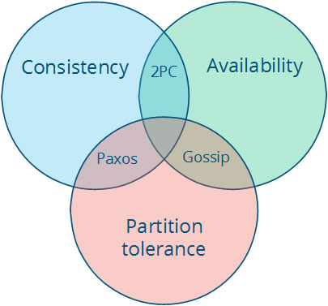

# distributedbook
分布式系统

　　分布式系统从当初的CORBA 到EJB，Web和SOA，从集群到现在的NoSQL 云计算和大数据Hadoop等分布式系统，横向水平扩展Scala out/in是分布式系统设计的一个特点，可靠性 容错性是两个质量指标。

###什么是分布式系统？

　　一大批服务器组成一个集合，对于用户来说仍然是一个整体连贯系统。

　　A. Tanenbaum定义：分布式网络的计算机中的组件之间协调动作是通过消息进行通讯。

　　G. Coulouris定义：当你知道有一台电脑崩溃，但是你的软件运行从来不会停止。

　　Leslie Lamport定义：分布式系统是这样系统：旨在支持应用程序和服务的开发，可以利用物理架构 由多个自治的处理元素，不共享主内存，但通过网络发送异步消息合作。

　　与分层应用区别：分层的应用程序（例如，3层）是 划分应用程序逻辑，是一种逻辑分层，而不是物理，而分布式系统DS是物理分层，和实际部署有关。

　　与传统集中式系统相比：

　　集中式系统是一种Scale out/in，纵向扩展，要么向上升级服务器到中大型机，要么升级多核，增加CPU核数，集中式纵向扩展适合计算聚合度比较高的数据，而分布式适合计算松散数据，非结构化或半结构化数据。无论采取哪种扩展伸缩方案，需要根据业务数据特点而定。

　　任何分布式系统总是需要完成两个任务：计算和存储。计算和存储分离是分布式系统的重要特征。而通常在集中式或单机系统中，这两者是可能结合在一起，比如通过一个SQL语句实现查询后排序，查询是从存储中获得数据，排序是属于计算，因此这个SQL语句实际是将计算和存储耦合在一起。在应对大数据或大并发的情况下，这种方便的捆绑带来性能问题，而分布式计算和分布式存储虽然带来复杂性，但是也为系统的处理能力打开了上升拓展的空间。
　　
###分布式系统特点：
- 并发性：共享资源，采取ACID或Base原则，见：CAP定理。
分布式系统设计遵循CAP定理， CAP是：Consistency(一致性), Availability(可用性), 和 Partition tolerance(分区容错性) 可靠性 简称，CAP定理认为，CAP三种之中，只能同时满足其中两种。

- 可扩展性Scalable是重要特点，通过扩展能够获得高性能 高吞吐量 低延迟Latency。

- 可靠性/可用性:故障发现和处理以及恢复 容错处理。在一个正常运作系统中存在一个时间比例的条件。 如果一个用户不能访问系统比例增大，它被认为是不可用。可用性公式：
Availability = uptime / (uptime + downtime)
容错failover是指一个系统在错误发生的情况下，仍然一切运行正常。表示这个系统是宽容错误的。

- 消息处理: 具体产品有：RabbitMQ ZeroMQ Netty等等。

- 异构性： 不同操作系统 硬件 程序语言 开发者，中间件是一种解决方案。

- 安全性：授权认证 SSO单点登录 Oauth等等。

- 定位命令：
标识资源 URLs
命名服务Naming services
定位寻找Lookup
主要见SOA中的服务查找。如Zookeeper实现服务查找。

- 透明性：
访问透明度： 使用相同的操作本地和远程资源
位置透明：访问资源无需知道其物理或网络位置
并发透明度：多个进程可以同时运行访问使用共享资源，当不能干扰堵塞 它们的处理进程
复制透明性： 资源的多个实例可以被用来复制以提高可靠性和性能，但无需由用户编制专门的应用程序来实现。
故障透明度：出现软件硬件故障时，使用户和应用方案能继续完成他们的任务不受影响。
移动透明度：允许在 系统存在移动的资源和客户。
性能透明度：允许系统重新配置以 提高性能负荷变化
缩放透明度：在应用程序结构没有变化的情况下能够在规模上扩展或伸缩系统，以提高吞吐量处理能力。　
　
###分布式系统的挑战

　　分布式系统是难于理解、设计、构建 和管理的，他们将比单个机器成倍还要多的变量引入到设计中，使应用程序的根源问题更难发现。SLA(服务水平协议)是衡量停机和/或性能下降的标准，大多数现代应用程序有一个期望的弹性SLA水平，通常按"9"的数量增加(如,每月99.9或99.99%可用性)。每个额外的9变得越来越难实现。

　　让事情更加复杂的是，我们越来越常见地看到：分布式系统的故障表现为间歇性错误或性能下降(俗称的限电)。这些失败模式耗费更多时间来诊断。例如，Joyent经营一些分布式系统作为其云计算基础设施的一部分。在这样一个系统中，包括高可用性、分布式的键/值存储，Joyent最近经历了瞬态应用程序超时。对于大多数用户系统运行正常，其反应延迟也是在SLA范围内。然而，有百分之5 - 10的请求超出了一个预定义的程序超时。这样的失败问题并没有重现在开发或测试环境中，他们经常会"消失"几分钟到几小时。排除这个故障的根本是需要大量数据存储的系统分析。

　　这些系统包括：数据存储API(node . js)，RDBMS(关系数据库管理系统)和由系统内部使用(PostgreSQL)以及操作系统和终端用户应用程序依赖于的键/值系统。最终，导致过度的根本问题是在应用程序语义锁定，但确定之前需要相当大的数据收集和相关性工作，包括工程师耗费大量工作时间以及学习不同领域的专业知识。

　　分布式系统由两个物理因素的限制：

- 节点的数量（能够增加所需的存储和计算能力）
- 节点之间的距离（信息的传送距离，最好以光速）

这两个约束导致下面值得挑战的情况发生：

- 独立节点随着数目的增加发生故障的概率增加（减少可用的和管理成本增加）
- 独立节点随着数目增加可能会增加节点之间的通信的消耗（随着规模的增大性能降低）
- 地理距离的增加提高遥远的节点之间的通信延迟（减少某些操作的性能）

###如何架构分布式系统

　　适用于分布式系统架构的最常见的一个术语是SOA(面向服务架构)。SOA可以避免不愉快的CORBA(公共对象请求代理体系结构)，通过WS - *标准，一套松散耦合的Web服务完成独立的小功能，并且彼此独立，他们是一个有弹性的分布式系统的基础。对比上一代，服务是新流程，他们是正确的抽象层次系统中的离散功能。

　　构建面向服务架构的第一步是确定每个函数功能如何构成整体业务目标，将这些业务映射到离散的服务，且具有独立的断层边界、扩展性和数据负载量。确定为每个服务时，您必须考虑下列事项：

 - 地理. 系统是全球还是地区单独运行？
 - 数据隔离. 这个系统提供一个单个或多租户模型？
 - SLAs. 可用性 延迟 吞吐量 一致性和冗余性都必须定义。
- 安全. IAAA (身份identity, 验证authentication, 授权authorization, 和 审核audit), 数据的保密性和隐私性都必须考虑
- 可用性跟踪. 了解系统的使用是每天系统的日常运作，如容量规划。也可能用于执行计费系统的使用和/或治理(配额/速度限制)。
部署和配置管理. 系统是如何部署更新?
 

###分布式系统的模型抽象

系统模型（异步/同步）
失效模型（崩溃故障，分区）
一致性模型（强，最终）
　　通常，我们最熟悉的模式（例如，一个分布式系统上实现共享内存抽象）是太昂贵了。一个分布式系统越弱势越能保证其中元素有更大的行动自由，从而焕发潜在的更大的性能- 但它也可能导致很难管理。这就需要我们有极大智慧，不能以牺牲性能换来管理的方便性。因此，试图将分布式系统看成一个统一的单一系统的思维会阻碍分布式系统的扩展。

　　分布式系统遵循CAP定律，在高一致性 高可用性和分区容错性之间三选二：
　　
　　
　　
___

- CA (consistency高一致性 + availability高可用性). 使用2pc 两阶段事务提交来保证。其缺点无法实现分区容错性，一旦某个操作失败，整个系统就出错，无法容忍(水至清则无鱼)。
- CP (consistency高一致性 + partition tolerance分区容错性). 使用Paxos来保证，可用性降低。
- AP (availability高可用性 + partition tolerance分区容错性). 使用Gossip等实现最终一致性，如Dynamo.

如何正确理解CAP理论？
 

###分布式系统的设计技巧：分区和复制

　　对于一个数据集有两种设计方式：

- 分区：它可以被分割在多个节点，以允许更多的并行处理。有更好的性能，但是容错能力低。
- 复制：它也可以被复制或缓存在不同的节点上，以减少在客户端和服务器之间的距离，更强的容错能力，但是复制消耗性能。关键是复制数据之间的一致性。弱一致性提供更低的延迟和更高的可用性。
 
###分布式系统的设计技巧：时钟和顺序

　　分布式系统针对计算和存储的策略是不同的，对于数据的存储主要是分区和复制，而对于计算主要是保证事件的顺序，因为分布式计算任务是由事件驱动的，比如Storm等等。那么事件的顺序代表了业务逻辑的顺序，事件有时是树形嵌套事件，可靠性就是必须保证一个树形集合所有事件都得到网站执行是一个事务原子的。参考流式大数据处理模式。

