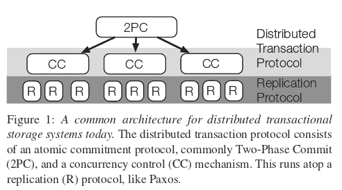

ACID和CAP的详尽比较

　　事务机制ACID和CAP理论是数据管理和分布式系统中两个重要的概念，很不巧，这两个概念中都有相同的“C”代表 "Consistency" 一致性，但是实际上是完全不同的意义，下面是比较两个概念的不同之处。

什么是ACID？

　　事务的定义和实现一直随着数据管理的发展在演进，当计算机越来越强大，它们就能够被用来管理越来越多数据，最终，多个用户可以在一台计算机上共享数据，这就导致了一个问题，当一个用户修改了数据而另外一个还在使用旧数据进行计算过程中，这里就需要一些机制来保证这种情况不会发生。

　　ACID规则原来是在1970被Jim Gray定义，ACID事务解决了很多问题，但是仍然需要和性能做平衡协调，事务越强，性能可能越低，安全可靠性和高性能是一对矛盾。

　　一个事务是指对数据库状态进行改变的一系列操作变成一个单个序列逻辑元操作，数据库一般在启动时会提供事务机制，包括事务启动 停止 取消或回滚。

　　但是上述事务机制并不真的实现“事务”，一个真正事务应该遵循ACID属性，ACID事务才真正解决事务，包括并发用户访问同一个数据表记录的头疼问题。

　　ACID的定义：

Atomic原子性: 一个事务的所有系列操作步骤被看成是一个动作，所有的步骤要么全部完成要么一个也不会完成，如果事务过程中任何一点失败，将要被改变的数据库记录就不会被真正被改变。
Consistent一致性: 数据库的约束 级联和触发机制Trigger都必须满足事务的一致性。也就是说，通过各种途径包括外键约束等任何写入数据库的数据都是有效的，不能发生表与表之间存在外键约束，但是有数据却违背这种约束性。所有改变数据库数据的动作事务必须完成，没有事务会创建一个无效数据状态，这是不同于CAP理论的一致性"consistency".
Isolated隔离性: 主要用于实现并发控制, 隔离能够确保并发执行的事务能够顺序一个接一个执行，通过隔离，一个未完成事务不会影响另外一个未完成事务。
Durable持久性: 一旦一个事务被提交，它应该持久保存，不会因为和其他操作冲突而取消这个事务。很多人认为这意味着事务是持久在磁盘上，但是规范没有特别定义这点。
 

什么是CAP？

　　CAP是分布式系统中进行平衡的理论，它是由 Eric Brewer发布在2000年。

Consistent一致性: 同样数据在分布式系统中所有地方都是被复制成相同。
Available可用性: 所有在分布式系统活跃的节点都能够处理操作且能响应查询。
Partition Tolerant分区容错性: 在两个复制系统之间，如果发生了计划之外的网络连接问题，对于这种情况，有一套容错性设计来保证。
 

　　一般情况下CAP理论认为你不能拥有上述三种中两种，这是一个实践总结，当有网络分区情况下，也就是分布式系统中，你不能又要有完美一致性和100%的可用性，只能这两者选择一个。在单机系统中，你则需要在一致性和延迟性latency之间权衡。

 

CAP和ACID一致性区别

　　ACID一致性是有关数据库规则，如果数据表结构定义一个字段值是唯一的，那么一致性系统将解决所有操作中导致这个字段值非唯一性的情况，如果带有一个外键的一行记录被删除，那么其外键相关记录也应该被删除，这就是ACID一致性意思。

　　CAP理论的一致性是保证同样一个数据在所有不同服务器上的拷贝都是相同的，这是一种逻辑保证，而不是物理，因为光速限制，在不同服务器上这种复制是需要时间的，集群通过阻止客户端查看不同节点上还未同步的数据维持逻辑视图。

　　当跨分布式系统提供ACID时，这两个概念会混淆在一起，Google’s Spanner system能够提供分布式系统的ACID，其包含ACID+CAP设计：

