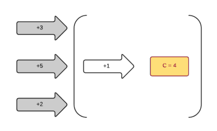
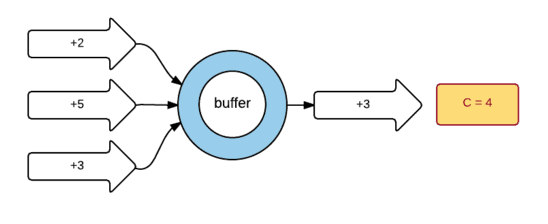
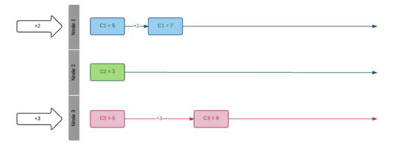
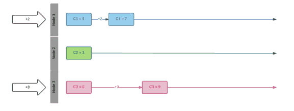
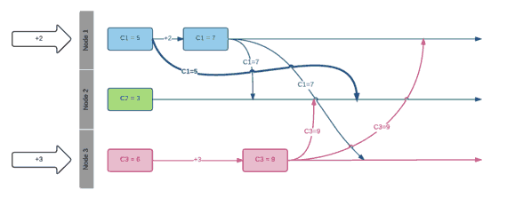

#如何建立一个分布式计数器？

　　本文通过介绍如何建立一个分布式环境下的计数器，从而引入CRDT数据结构(Conflict-free Replicated Data Type 无冲突可复制的数据类型)。

　　所谓计数器就是在原有值的基础上再增加一个值得到新的值，如果多个用户同时并发增加计数器，那么我们如何处理这种分布式情况呢？

　　按照通常思路可能觉得比较容易，只要确保某个时刻计数器只被一个用户更新即可，这种顺序方式虽然也可以进行，但是失去了并发性，我们如何提高这种方式的并发性呢？
　　

这必须通过克服锁的方式，比如使用CAS(compare and swap)可以提高整体的吞吐量，在一个高负载情况下，持续更新计算器会造成一些用户挨饿，所以，这是一个好的方式但是不理想。

另外一个办法是：只有一个用户会在某个时刻增加计数器数值，而其他用户会将数值增加的请求放入队列中，这确实能够提高吞吐量，但是计数器自身却不是分布式的。

让我们将这个计数器真正分布式并且切分它：取代整个系统一个写操作，让我们为每个用户都能写入到自己的计数器中，现在每个用户当它需要改变它的计数器数值时就能直接修改，它只改变的是自己的数值，这样我们就有了并发同时发生的数值增加：

现在看来已经是分布式的，那么如何得到最后的整个计数器结果？只要将单独的这些计数器加起来即可。

现在，为了得到一个全局整体的计数器，每个节点用户都需要知道彼此另外节点上的计数器值，让我们在节点间广播这些值：

现在有趣事情来了，网络世界不是100%可靠，广播的消息有可能会丢失或延迟到达。解决消息丢失并不容易，让我们来看看如何解决：

在发送方，节点服务器规则地广播它们的状态。
在接收方，我们需要一种方式搞清楚发现消息的重复，节点服务器通过比较接受值和现有值，如果这两个值是相同的表示这是重复的消息，否则就是一个新的消息，更新原来的值即可。
最后我们来解决延迟消息问题。这有点狡猾，如何知道接受的消息是延迟的不是最新的stale？

为了解决这个问题，我们施加系统一些强制要求，假设计算器总是不断向前增加，不允许减少。那么现在该发现当接受到消息应该怎么做了：只要选择接受值和现有值之间最大差值的那个值。

这样，每个节点都知道接受到消息后该怎么做，我们有了最终强一致性，因为只要一个节点接受到所有广播消息事件（无论以任何顺序），它会知道计数器当前状态，每个节点的状态也是相同的，没有冲突，所有节点最终会汇聚到相同的值。

这种分布式数据结构就是著名的CRDT（Conflict-free Replicated Data Type 无冲突可复制的数据类型）。

在我们这个案例中，我们广播了本地状态，也就是当前计数器值，这样我们计数器就是生活在基于CRDT状态世界里，或称为CvRDT( convergent CRDT)，我们只需要三件事定义一个CvRDT：

- 一个集合set (比如正整数)
- 一个局部顺序partial order (比如值只能保持不断增加的顺序)
- 一个二进制操作，它是可组合的associative, 可交换的commutative 和幂等的idempotent (比如最大函数Max function)

这三个属性形成叫半格semi-lattice，这就是我们需要定义CRDT的全部，可组合associative允许以任何顺序发布消息事件，可交换commutative允许以任何顺序处理消息，幂等允许能够重播消息。

使用CRDT的好处是它们可以组合，记住我们的计数器限制是：无减法，我们可以使用第二计数器解决这个问题，这个计数器也是只有一个同样规则，只跟踪数值的减法。

CRDT也是失败容错的，当整个系统只有一个节点存货，其他节点能在恢复时自动恢复到之前状态。

目前CRDT应用在 Riak 数据库，能够和Akka Actor模型协调工作。
