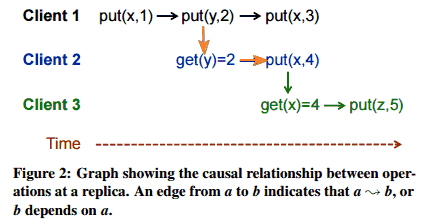

#分布式系统因果一致性与COPS算法

　　COPS是保序系统的集群(Clusters of Order Preserving System)的简称。在了解COPS之前，最好首先了解一下分布式系统CAC算法，从CAP-->CAC-->COPS是分布式系统的确保高性能低延迟高可扩展性的前提下追求高一致性直至事务机制的发展路径。

　　 COPS系统能够提供因果+一致性causal+ consistency，设计为支持复杂的在线应用，这些应用托管在少量的大规模数据中心，每个应用都是有前端服务器(COPS客户端)以及后端key-value数据存储，COPS在本地数据中心以线性化方式执行所有的put写操作和get读操作，然后会跨数据中心以因果一致性的顺序在后台进行复制。

　　通过COPS我们能够获得ALPS：Availability, Low-Latency,Partition-tolerance, 和 Scalability.

可用性 Availability: 所有操作读能成功，没有会无限期堵塞或返回一个显示数据不可用的错误。
低延迟Low-latency: 目标响应时间在毫秒级别。
分区容错Partition tolerance: 数据存储能够在网络分区的情况下持续操作。
可扩展性Scalability: 数据存储能够线性水平扩展。
　　按照CAP定理，这种ALPS系统必然会牺牲强一致性，比如linearizability线性一致性，但是我们还是能够在此约束下寻找到最强的一致性，也就是因果一致性。

　　下面看看什么是因果一致性。我们假设一个key-value数据存储，有两个基本操作: put(key,val) 和 get(key)=val. 这个类似于在单机的共享内存系统中的读操作和写操作(可参考：Go语言Goroutine与Channel内存模型)。

　　我们约定遵循下面三个规则表示潜在一致性，用符号表达 ->：

在同一执行线程：. 如果a 和 b 是一个执行线程中的两个操作，如果操作a发生在操作b之前，那么a ->b；
不同线程Gets From. 如果 a是一个put放入操作，且b是一个获得操作，能返回被a放入的写操作结果值，那么a->b；
传递性Transitivity. 对于操作a, b, 和 c, if a -> b 且 b -> c, 那么 a -> c.
 

　　这些规则在同一个线程内的操作之间以及在与数据存储交互的不同线程的操作之间创建了潜在的因果关系，这个模型，并不允许线程直接通讯，而是通过数据存储进行通讯。

　　下面我们使用这个因果规则来看看具体分布式系统的情况，如下图：

上图模拟了三个规则，在同一执行线程规则是get(y)=2 -> put(x,4)（图中的client 2）；而gets from规则是put(y,2) -> get(y)=2（图中client1和client2中间纵向，代表两个不同线程的写读操作）; 而传递性规则是 put(y,2) -> put(x,4)（根据前两个规则推导出的因果性）。即使一些操作如put(x,3)也实时发生了。因为没有其他操作依赖它， 没有任何其他读操作会读取器写入的值，也没有同一个线程内存中跟随其后的其他操作，因此，client3获得的x值是4，而不是3。

　　因果一致性是指在一个分布式复制环境通过get操作获得的值结果是由->顺序定义的。以上图来说，似乎put(y,2)发生在put(x,4)之前，而put(x,4)发生在put(z,5)之前，如果client2看到get(x)=4然后又看到get(x)=1，那么就违背了因果一致性了。

　　因果一致性并不对并发操作排序，如果 a不在b之前发生，b也不在a之前发生，那么a 和b是并发的，a和b是两个不相关的操作，那么它们在分布式系统中复制就不必遵循任何顺序了，这样就避免了在它们之间使用因果这种串行化方式。

　　但是，如果a和b进行的是使用相同key值的put写操作，那么就发生冲突了。比如a操作是put(x,1)，b操作是put(x,2)，那么一个复制节点就永远返回x值为1；另外一个返回x值为2；还有一种意外情况发生，两个人使用同样的用户名登录，同时将商品放入他们的购物车，那么与用户帐户一一对应的购物车该选择哪个商品放入呢？

　　解决这种冲突是采取基于 Lamport clock的 last-writer-win策略：

　　初始存储节点使用一个Lamport时间错为每次更新分配唯一的版本号，节点将版本号作为其高位字节，低位字节保存的是节点标识，. Lamport时间戳允许COPS将每个key的所有写操作维护全局的顺序。这个顺序暗含了实现last-writer-win的收敛冲突策略 (convergent conflict handling policy）。
　
[Don’t Settle for Eventual:
Scalable Causal Consistency for Wide-Area Storage with COPS](https://www.cs.cmu.edu/~dga/papers/cops-sosp2011.pdf)