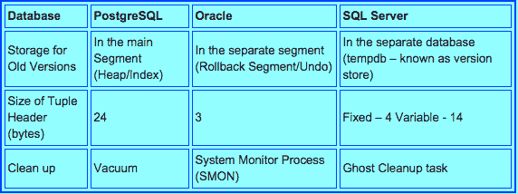

PostgreSQL、Oracle/MySQL和SQL Server的MVCC实现原理方式

　　关系数据库管理系统使用MVCC(Multiversion Concurrency Control多版本并发控制)来避免写操作堵塞读操作的并发问题，MVCC也就是通过使用数据的多个版本保证并发读写不冲突的一种机制，不同的数据库有不同的实现，这也是数据库系统让人头疼的地方，关系数据库表面看上去很简单方便，使用标准的SQL语句操作让人很放心，但是随着系统规模增加，并发用户增加，数据库会出现性能降低的现象，这时我们可能需要从外部的微调进入到内部原理的深入研究，而每个数据库内部实现并发的原理都是不同的，如果我们拥有多个不同的数据库，那么需要不同的调校方法，这时作为生产系统的核心数据库开始变得不那么让人放心，本文提供了市面上几种流行数据库的内部MVCC不同的实现。

 

MVCC的两种不同实现方式

　　第一种实现方式是将数据记录的多个版本保存在数据库中，当这些不同版本数据不再需要时，垃圾收集器回收这些记录。这个方式被PostgreSQL和Firebird/Interbase采用，SQL Server使用的类似机制，所不同的是旧版本数据不是保存在数据库中，而保存在不同于主数据库的另外一个数据库tempdb中/

　　第二种实现方式只在数据库保存最新版本的数据，但是会在使用undo时动态重构旧版本数据，这种方式被Oracle和MySQL/InnoDB使用。

　　下面看看具体数据库实现机制。

 

PostgreSQL的MVCC

　　在PostgreSQL中，当一行记录被更新时，该行数据的新版本(称为tuple)将被创建并插入表中，之前版本提供一个指针指向新版本，之前版本被标记为"expired"过期，但是还保留在数据库直到垃圾收集器回收掉。

为了支持多版本，每个tuple有以下附加数据记录：

xmin – 插入更新记录和创建这个tuple的事务的ID
xmax – 删除记录或创建这个tuple新版本或删除记录的事务。这个字段初始是null.
事务状态是保存在 $Data/pg_clog的CLOG中. 这个表包含每个事务状态信息的两个字节，可能的状态有in-progress, committed, 或  aborted。 当一个事务结束后，PostgreSQL并不会将数据库记录的改变undo回滚的，它只是在CLOG标记事务为aborted . 一个PostgreSQL表可能包含许多这样aborted退出事务的数据。

一个称为Vacuum 清理进程会提供expired过期/aborted退出的记录版本的垃圾回收，Vacuum 清理器也会删除被垃圾回收的tuple相关的索引项。

一个tuple的xmin是有效且xmax无效时，它是可见的。 “Valid有效” 意味着 “或者是 committed 或代表当前事务”. 为了避免反复操作CLOG 表, PostgreSQL 在tuple中维持状态标识，以表示tuple是否是“known committed” 或 “known aborted”.

 

Oracle的MVCC

　　Oracle是在回滚段(也就是‘undo log’)中保存旧版本， 一个事务ID并不是一个顺序数字，而是由一系列数字组成，这些数字指向回滚段的头部事务槽 (slot)。 回滚段能让新事务能重用存储，重用被已经提交或退出的旧事务使用过的事务槽，这种自动重用机制使得Oracle使用有限的回滚段可以管理大量的事务。

回滚段的头部块是用作一个事务表，这里保存着事务的状态，称为System Change Number或 SCN, Oracle并不是存储页面中的每个记录的事务ID， 而是通过保存页面中每行记录的唯一事务ID的数组阵列节约空间使用， 只保存记录的数组偏移量offset，和每个事务ID保存在一起的是一个指针，指向该页事务创建的最后undo记录，不仅表记录是这种方式存储，索引记录也是使用同样技术，这是Oracle和PostgreSQL主要区别之一.

当一个Oracle事务启动时，它会标记一个当前事务状态SCN. 当读取一个表或一个索引页时，Oracle使用SCN数字来决定该页是否包含不应该让当前事务知晓的事务影响效果， Oracle通过寻找相联的回滚段头部来检查该事务的状态，但是为了节约时间，第一次是真正查询事务，查询完成它的状态会被记录在该页中以避免后来再次查询，如果该页被发现包含不可见事务的影响，Oracle通过undoing每个这样的事务影响来重新创建该页的旧版本。它扫描和每个事务有关的记录，将这些事务效果应用到该页，直至那些所有事务效果应用完成后被移除，以该方式创建的新页再用于访问其中的tuple。

Oracle中的记录头：
一个记录头部不会增长，总是有固定大小，对于非集群的表，记录头部是3个字节，一个字节被用于存储标识，一个字节用于显示记录是否被锁住(比如它被更新了但是没有确认提交committed), ，一个字节用于列计数。

 

SQL Server的MVCC

　　在SQL Server数据库内部使用记录版本实现快照隔离和读取提交，只有需要此项的数据库才会必须开启并且会产生相应的成本开销。

当一个记录被修改或删除时，使用copy-on-write机制能够有效地启动版本，Row versioning–based 事务能够有效地“view看到” 数据的从过去到现在的的前后一致的各种版本。

记录版本Row version保存在版本存储中，其驻留在主数据库之外的tempdb数据库中，  更特别地，当一张表或索引中一个记录被修改，新记录将携带上执行修改的事务的 ”sequence_number”. 记录的旧版本将被拷贝到版本存储中, 新记录包含一个指针指向版本存储中的这个旧记录，如果多个长运行 long-running事务存在，并且需要多个 ”版本versions”, 在版本存储中的记录也许包含指向该记录更早版本的指针。

SQL Server的版本存储清除：
SQL Server自动管理版本存储的大小，维持一个清除线程来确保版本存储中记录版本数量不至于太长，超过需要，对于在快照隔离下运行的查询，版本存储保留记录版本直到修改数据的事务完成，并且事务包含的任何需要修改数据的语句全部完成，对于在Read Committed 快照隔离下运行的SELECT语句 ，一个特别的记录版本就再也不需要了，一旦SELECT语句执行完成就被移除。

如果tempdb已经没有空闲空间， SQL Server会调用清除功能，增加文件的大小，当然前提是假设我们配置文件是自动增长的，  如果磁盘已经没有空间，文件不能自动增长， SQL Server会停止产生版本，如果这种情况发生，任何需要读取版本的快照查询因为空间限制将失败。

SQL Server中记录头
4 字节
- 两字节记录元数据(记录类型)
- 两字节向前指向记录中的NULL 位图bitmap. 这是记录(固定长度列)实际大小的差值offset.

版本标记Versioning tag – 这是一个14-byte结构，包含时间戳加一个指向tempdb中版本存储的指针，这里时间戳是 trasaction_seq_number, 当需要支持一个版本操作时，加入版本信息到记录中时的时间。

下图是各个数据库的对比总结：

原文：[Open Enterprise: The PostgreSQL Open Source Database Blog from EnterpriseDB](http://blogs.enterprisedb.com/2015/03/18/well-known-databases-use-different-approaches-for-mvcc/)