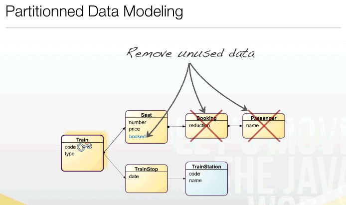

#缓存 数据分区和复制

使用客户端缓存

- 通过Http头部控制，控制客户端浏览器缓存。
- Http缓存Last-Modified、ETag和Expires的Java终结解决之道
- 使用Apache压缩mod_inflate传输http包。或Tomcat配置压缩

##Http缓存原理

第二次请求：

##分布式缓存模式

- Write-through 立即写
- Write-behind   后写
- Eviction Policies 驱逐策略 缓存更新策略
- Replication 复制
- Peer-To-Peer (P2P)

###各种缓存性能对比图：

Eviction policies缓存更新策略

- TTL (time to live) 缓存生存期
- Bounded FIFO (first in first out) 先进先出
- Bounded LIFO (last in first out)
- Explicit cache invalidation 清除无效缓存

###缓存问题：内嵌对象更新 
缓存难点：不变形和可变性

 1. 将经常需要变化的属性组成子对象，与不变性的属性在生命周期上区分开来。降低可变性更新带来锁粒度，保证性能。

 2. 使用数据库悲观锁或Java线程锁对可变性对象锁定更新。

3. 尽量利用JDK5.0 reentereadwriteLock高性能锁，适合大量读取，个别或一个修改情况。比同步性能好

##分布式缓存产品

- EHCache 结合terracotta兵马俑
- JBoss Cache
- OSCache
- memcached

###memcached

- 非常快
- 简单
- Key-Value (string ‐> binary)
- Clients for most languages
- 分布式 Distributed
- 无复制Not replicated - so 1/N chance

###Consistent Hashing一致性哈希

- 因为有很多服务器节点，需要一个方法将Key映射到对应节点
- partition = key mod (服务器总数) 缺点：
   当调整节点时会影响现有的节点。

- CH依赖环， key依赖按顺时针方向节点

数据库演化

##状态的scalable考量CAP定律

- Consistency(一致性): 数据一致更新,每个客户端看到的是一致数据。
- Availability(可用性), 代表延迟性，响应性能，如：每个客户端总是能顺利读写，而不是堵塞被等待延迟。
- Partition tolerance(分区容错性) 可切分性，跨不同分区能正常工作。

##集中式系统Centralized system

类似RDBMS关系数据库这样的中央集中式系统，无法进行分区，No P.
只能选择下面两个：
  
- Availability 可用性。

-  Consistency 一致性。

##关系数据库的ACID 实现

- Atomicity原子性：一个事务中所有操作都必须全部完成，要么全部不完成。
- Consistency一致性. 在事务开始或结束时，数据库应该在一致状态。
- Isolation隔离层. 事务将假定只有它自己在操作数据库，彼此不知晓。
- Durability. 一旦事务完成，就不能返回。
跨数据库事务：2PC (two-phase commit)

##2PC (two-phase commit)

- 首先, 事务协调员向每个服务器询问一遍，要求每个数据库都进行precommit的操作和是否可能实现 commit. 如果所有数据库都同意commit ，第二段开始。
- 第二段：事务协调员要求每个数据库commit数据. 如果任何数据库否决commit, 那么所有数据库将被要求回滚。
- 当事务对某个数据库锁定时，这个数据库或列就不可用，或者响应时间很慢。牺牲可用性了。2PC is the anti-scalability pattern (Pat Helland)

##关系数据库的水平伸缩

有两种方式：按功能划分数据库或sharding碎片。
切分有风险，实质是切断数据之间的关系，难度大，老虎嘴上拔毛。

##Sharding
- Partitioning 切分分区：
   将数据切分到多个数据库中，分散访问。
   因为数据是有状态的，必须有可靠机制保证某个服务器能够访问到上次访问的数据库。

- Replication  复制

##分区和复制

上图是分区，注意User是以A-z字母分区，下图是复制

