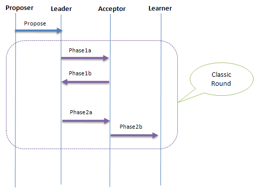
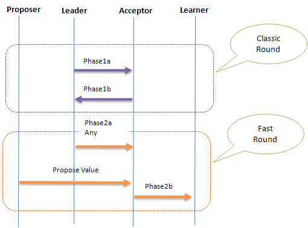

#Fast Paxos

自从Lamport在1998年发表Paxos算法后，对Paxos的各种改进工作就从未停止，其中动作最大的莫过于2005年发表的Fast Paxos。无论何种改进，其重点依然是在消息延迟与性能、吞吐量之间作出各种权衡。为了容易地从概念上区分二者，称前者Classic Paxos，改进后的后者为Fast Paxos。  

###1. Fast Paxos概览
Lamport在40多页的论文中不仅提出了Fast Paxos算法，并且还从工程实践的角度重新描述了Paxos，使其更贴近应用场景。从一般的Client/Server来考虑，Client其实承担了Proposer和Learner的作用，而Server则扮演Acceptor的角色，因此下面重新描述了Paxos算法中的几个角色：  

- Client/Proposer/Learner：负责提案并执行提案
- Coordinator：Proposer协调者，可为多个，Client通过Coordinator进行提案
- Leader：在众多的Coordinator中指定一个作为Leader
- Acceptor：负责对Proposal进行投票表决

就是Client的提案由Coordinator进行，Coordinator存在多个，但只能通过其中被选定Leader进行；提案由Leader交由Server进行表决，之后Client作为Learner学习决议的结果。  

这种方式更多地考虑了Client/Server这种通用架构，更清楚地注意到了Client既作为Proposer又作为Learner这一事实。

同样要注意到的是，如果Leader宕机了，为了保证算法的正确性需要一个Leader的选举算法，但与之前一样，Lamport并不关心这个Leader选举算法，他认为可以简单地通过随机或超时机制实现

另外在Classic Paxos中，从每次Proposer提案到决议被学习，需要三个通信步骤：
Proposer-----Leader-----Acceptor-----Learner
从直观上来说，Proposer其实更“知道”提交那个Value，如果能让Proposer直接提交value到Acceptor，则可以把通信步骤减少到2个。Fast Paxos便是基于此而产生。

###2. Make Paxos Faster


我们再回顾下Classic Paxos的几个阶段： 

- Phase1a：Leader提交proposal到Acceptor
- Phase2b：Acceptor回应已经参与投票的最大Proposer编号和选择的Value
- Phase2a：Leader收集Acceptor的返回值
- Phase2a.1：如果Acceptor无返回值，则自由决定一个
- Phase2a.2： 如果有返回值，则选择Proposer编号最大的一个
- Phase2b：Acceptor把表决结果发送到Learner 

很明显，在Phase2a.1中，如果Leader可以自由决定一个Value，则可以让Proposer提交这个Value，自己则退出通信过程。只要之后的过程运行正常，Leader始终不参与通信，一直有Proposer直接提交Value到Acceptor，从而把Classic Paxos的三阶段通信减少为两阶段，这便是Fast Paxos的由来。因此，我们更加形式化下Fast Paxos的几个阶段：

- Phase1a：与之前相同
- Phase1b：与之前相同
- Phase2a：Leader收集Acceptor的返回值
- Phase2a.1：如果Acceptor无返回值，则发送一个Any消息给Acceptor，之后Acceptor便等待Proposer提交Value
- Phase2a.2：如果有返回值，则根据规则选取一个
Phase2b：Acceptor把表决结果发送到Learner（包括Leader）

算法主要变化在Phase2a阶段，即：

- 若Leader可以自由决定一个Value，则发送一条Any消息，Acceptor便等待Proposer提交Value  

- 若Acceptor有返回值，则Acceptor需选择某个Value

先不考虑实现，从形式上消息仅需在Proposer-----Acceptor-----Learner之间传递即可，也即仅需2个通信步骤。下面我们详细说明算法过程：

####3 一些定义

- Quorum
在Classic Paxos中一直通过多数派（Majority）来保证算法的正确性，对多数派再进一步抽象化，称为“Quorum”，要求任意两个Quorum之间有交集（从而间接表达了majority的含义）
- Round
在Classic Paxos中，Proposer每次提案都用一个全序的编号表示，如果执行顺利，该编号的Proposal在经历Phase1，Phase2后最终会执行成功。
在Fast Paxos称这个带编号的Proposal的执行过程为“Round”
- i-Quorum
在Classic Paxos执行过程中，一般不会明确区分每次Round执行的Quorum，虽然也可以为每个Round指定一个Quorum。在Fast Paxos中会通过i-Quorum明确指定Round i需要的- Quorum
- Classic Round
执行Classic Paxos的Round称为Classic Round
- Fast Round
如果Leader发送了Any消息，则认为后续通信是一个Fast Round；若Leader未发送Any消息，还是跟之前一样通信，则后续行为仍然是Classic Round。
根据Lamport描述，Classic Round和Fast Round可通过Round Number进行加以区分。


4 Any消息
在正常情况下，Leader若可以自由决定一个Value，应该发生一条Phase2a消息，其中包含了选择的Value，但此时却发送了一条无Value的Any消息。Acceptor在接收到Any消息后可做一些开始Fast Round的初始化工作，等待Proposer提交真正的Value。Any消息的意思是Acceptor可以做任意的处理。  

因此，一个Fast Round包括两个阶段：由Any消息开始的阶段，和 由Proposer提交Value的结束阶段，而Leader只是起到一个初始化过程的作用，如果没有错误发生，Leader将退出之后的通信中过程。
下面是Classic Paxos交互图：



下面是Fast Paxos的交互图：




5 冲突
在Classic Paxos中，Acceptor投票的value都是Leader选择好的，所以不存在同一Round中投票多个Value的场景，从而保证了一致性。但在Fast Round中因为允许多个Proposer同时提交不同的Value到Acceptor，这将导致在Fast Round中没有任何value被作为最终决议，这也称为“冲突”（Collision）  

Proposer提交的Round是全序的，不同的Proposer提交的Round肯定不一样，同一Proposer不可能在同一Round中提交不同的Value，那为什么还会有同一Fast Round中有多个Value的情况？原因在于Fast Round与Round区别，当Fast Round开始后，会被分配一个唯一的Round Number，之后无论多少个Proposer提交Value都是基于这个Round Number，而不管Proposer提交的Round是否全序。  

比如，Fast Round Number为10，Proposer1提交了（11，1），Proposer2提交了（12，2），但对Fast Round来说存在（10，1，2）两个Value。

因为冲突的存在，会导致Phase2a.2的选择非常困难，原因是：  

在Classic Paxos中，如果Acceptor返回多个Value，只要排序，选择最高的编号对应的Value即可，因为Classic Paxos中的Value都是有Leader选择后在Phase2a中发送的，因此最高编号的Value肯定只有一个。但在Fast Paxos中，最高编号的Value会发现多个，比如（10，1，2）。  

假如当前Leader正在执行第i个Classic Round(i-Quorum为Q) ，得到Acceptor反馈的最高编号为k，有两个value：v、w，说明Fast Round k存在两个k-Quorum，Rv,Rw。  

O4(v)：下面定义在Round k中v或w被选择的条件：  

如果v在Round k中被选择，那么存在一个k-Quorum R，使得对任意的Acceptor a∈Q∩R，都对v作出投票。  

这个问题也可表述为：R中的所有Acceptor都对v作出投票，并且Q∩R≠φ，因为如果Q∩R=φ，则Round i将无法得知投票结果

因此如果保证下面两个条件：  

- 每个Acceptor在同一Fast Round中仅投票一个Value
- Q∩Rv∩Rw≠φ
则v、w不可能同时被选择

###6 确定Quorum
根据上面描述，为了防止一次Fast Round选择多个Value，Quorum需要满足下面两个条件： 

- 任意两个Classic Quorum有交集  

- 任意一个Classic Quorum与任意两个Fast Quorum有交集

不妨设总Acceptor数为N，Classic Round运行的最大失败Acceptor数为F，Fast Round允许的失败数为E，即N-F构成Classic Round的一个Quorum，N-E构成Fast Round的一个Quorum。
上面两个条件等价于：

N>2F
N>2E+F

设Qc,Qf分别为Classic和Fast Round的Quorum大小，经过整理可得两个下限结果：

- |Qc| = |Qf| ≥ N − ⌈N/3⌉ + 1 ≥ ⌊2N/3⌋ + 1

- |Qc| ≥N-⌈N/2⌉+1 = ⌈N/2⌉+1
|Qf|≥N-⌈N/4⌉≥⌈3N/4⌉ 

证明请参考：一致性算法中的节点下限


###7 冲突Recovery
作为优化，Acceptor在投票Value时也应该发送到Leader，这样Leader就很容易能发现冲突。Leader如果在Round i发现冲突，可以很容易地开始Roun i+1，从Phase1a开始重新执行Classic Paxos过程，但这个其实可以进一步优化，我们首先考虑下面这个事实：
如果Leader重启了Round i+1，并且收到了i-Quorum个Acceptor发送的Phase1b消息，则该消息明确了两件事情：

- 报告Acceptor a参与投票的最大Round和对应的Value
- 承诺不会对小于i+1的Round作出投票  

假如Acceptor a也参与了Round i的投票，则a的Phase1b消息同样明确了上述两件事情，并且会把对应的Round，Value在Phase2b中发送给Leader（当然还有Learner），一旦Acceptor a执行了Phase2b，则也同时表明a将不会再对小于i+1的Round进行投票。 

也就是说，Round i的Phase2b与Round i+1的Phase1b有同样的含义，也暗含着如果Leader收到了Round i的Phase2b，则可直接开始Round i+1的Phase2a。经过整理，产生了两种解决冲突(Recovery)的方法： 

####7.1 基于协调者的Recovery
如果Leader在Round i 中收到了(i+1)-Quorum个Acceptor的Phase2b消息，并且发现冲突，则根据O4(v)选取一个value，直接执行Round i+1的Phase2a；否则，从Phase1a开始重新执行Round i+1


####7.2 基于非协调的Recovery
作为基于协调Recovery的扩展，非协调要求Acceptor把Phase2b消息同时发送给其他Quorum Acceptor，由每个Acceptor直接执行Round i+1的Phase2a，但这要求i-Quorum与(i+1)-Quorum必须相同，并且遵循相同选择value的规则。
这种方式的好处是Acceptor直接执行Round i+1的Phase2a，无需经过Leader，节省了一个通信步骤，缺点是Acceptor同时也作为Proposer，搞的过于复杂。


###8 Fast Paxos Progress

至此，再完整地总结下Fast Paxos的Progress： 

- Phase1a：与之前相同
- Phase1b：与之前相同
- Phase2a：Leader收集Acceptor的返回值
- Phase2a.1：如果Acceptor无返回值，则发送一个Any消息给Acceptor，之后Acceptor便等待Proposer提交Value
Phase2a.2：如果有返回值 

      2.1 如果仅存在一个Value，则作为结果提交
      2.2 如果存在多个Value，则根据O4(v)选取符合条件的一个
      2.3 如果存在多个结果并且没有符合O4(v)的Value，则自由决定一个
      
- Phase2b：Acceptor把表决结果发送到Learner（包括Leader）

###9. 总结
Fast Paxos基本是本着乐观锁的思路：如果存在冲突，则进行补偿。其中Leader起到一个初始化Progress和解决冲突的作用，如果Progress一直执行良好，则Leader将始终不参与一致性过程。  

因此Fast Paxos理论上只需要2个通信步骤，而Classic Paxos需要3个，但Fast Paxos在解决冲突时有至少需要1个通信步骤，在高并发的场景下，冲突的概率会非常高，冲突解决的成本也会很大。  

另外，Fast Paxos把Client深度引入算法中，致使其架构远没Classic Paxos那么清晰，也没Classic Paxos容易扩展。  

还有一点要注意的是，Fast Quorum的大小比Classic的要大，一般Fast Quorum至少需要4个节点(3E+1)，而Classic Paxos需要3个(2F+1)（请参考：一致性算法中的节点下限）。

总之，在我看来Fast Paxos是一个理论上可行，但实际中很难操作的算法，实际中用的比较多的还是Classic Paxos的各种简化形式

10 参考资料  

```
Fast Paxos(Lamport 2005)
Multicoordinated Paxos
On the Coordinator’s Rule for Fast Paxos
Classic Paxos vs. Fast Paxos
http://en.wikipedia.org/wiki/Paxos_(computer_science)


```