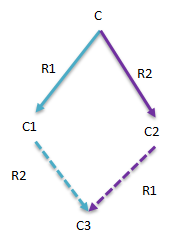
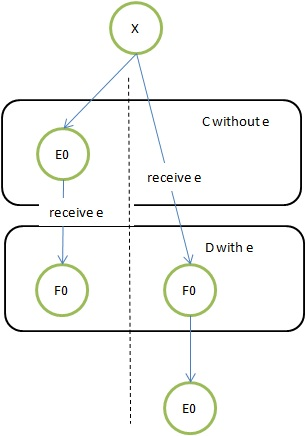
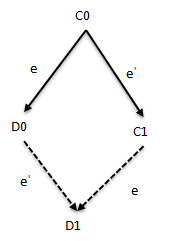
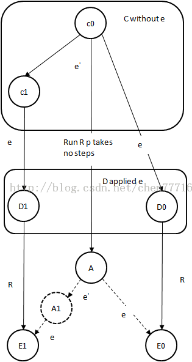

#FLP Impossibility

###1. FLP impossibility背景
FLP Impossibility（FLP不可能性）是分布式领域中一个非常著名的结果，该结果在专业领域被称为“定理”，其地位之高可见一斑。该定理的论文是由Fischer, Lynch and Patterson三位作者于1985年发表,之后该论文毫无疑问得获得了Dijkstra奖。
顺便要提一句的是，Lynch是一位非常著名的分布式领域的女性科学家，研究遍布分布式的方方面面，对分布式领域有着极其卓越的贡献，其著有<<Distributed Algorithms>>一书，书中有非常严谨而简洁的逻辑讨论了许许多多的分布式算法。
FLP给出了一个令人吃惊的结论：在异步通信场景，即使只有一个进程失败，也没有任何算法能保证非失败进程达到一致性！
因为同步通信中的一致性被证明是可以达到的，因此在之前一直有人尝试各种算法解决以异步环境的一致性问题，有个FLP的结果，这样的尝试终于有了答案。
FLP证明最难理解的是没有一个直观的sample，所有提到FLP的资料中也基本都回避了sample的要求。究其原因，sample难以设计，除非你先设计几种一致性算法，并用FLP说明这些算法都是错误的。

###2. 系统模型 
任何分布式算法或定理，都尤其对系统场景的假设，这称为系统模型。FLP基于下面几点假设：  

- 异步通信
与同步通信的最大区别是没有时钟、不能时间同步、不能使用超时、不能探测失败、消息可任意延迟、消息可乱序
- 通信健壮
只要进程非失败，消息虽会被无限延迟，但最终会被送达；并且消息仅会被送达一次（无重复）
- fail-stop模型
进程失败如同宕机，不再处理任何消息。相对Byzantine模型，不会产生错误消息
- 失败进程数量
最多一个进程失败

在现实中，我们都使用TCP协议（保证了消息健壮、不重复、不乱序），每个节点都有NTP时钟同步（可以使用超时），纯的异步场景相对比较少。但随着只能终端的发展，每个手机会为省电而关机，也会因为不在服务区而离线，这样的适用场景还是存在。
我们再衡量一个分布式算法是否正确时有三个标准：

- Termination（终止性）
非失败进程最终可以做出选择
- Agreement（一致性）
所有的进程必须做出相同的决议
- Validity（合法性）
进程的决议值，必须是其他进程提交的请求值

终止性，描述了算法必须在有限时间内结束，不能无限循环下去；一致性描述了我们期望的相同决议；合法性是为了排除进程初始值对自身的干扰。 

###3. 一个Sample

假设有A、B、C、D、E五个进程就是否提交事务为例，每个进程都有一个随机的初始值提交（0）或回滚（1）来向其他进程发送请求，进程自己必须接收到其他进程的请求后才能根据请求内容作出本地是提交还是回滚的决定，不能仅根据自己的初始值做出决定。如果所有的进程都做出相同的决定，则认为一致性达成（Validity属性）；根据前面的系统模型，允许最多一个进程失败，因此一致性要求要放松到允许非失败进程达成一致。当然，若有两个不同的值被不同的进程选择，则认为无法达成一致。  

现在目标是要设计这样一个算法，保证符合上述三个属性，并允许最多一个进程失败。  

假如我们设计一个算法P，每个节点根据多数派表决的方式判断本地是提交还是回滚：  

假如C收到了A、B的提交申请，收到了D的回滚申请，而C本身也倾向于回滚，此时，提交、回滚各有两票，E的投票决定着C的最终决议。而此时，E失败了，或者E发送给C的消息被无限延迟（无法探测失败），此时C选择一直等待，或者按照某种既定的规则选择提交或失败，后续可能E正常而C失败，总之，导致C没有做出最终决策，或者C做了最终决策失败后无人可知。称所有进程组成的状态为Configuration，如果一系列操作之后，没有进程做出决策称为“不确定的”Configuration；不确定Configuration的意思是，后续可能做出提交，也可能做出回滚的决议。  

相反，如果某个Configuration能准确地说会做出提交/回滚的决议，则称为“确定性”的Configuration（不确定/确定对应于原论文中的bivalent/univalent）。如果某个Configuration是确定的，则认为一致性是可以达成。  

对上述算法P，可能存在一种极端场景，每次都构造出一个“不确定”的Configuration，比如每次都是已经做出决议的C失败，而之前失败的E复活（在异步场景中，无法真正区分进程是失败，还是消息延迟），也就是说，因为消息被延迟乱序，导致结果难以预料！
而FLP证明也是遵循这个思路，在任何算法之上，都能构造出这样一些永远都不确定的Configuration，也就没有任何理论上的具体的算法，能避免这种最坏情况。

###4. Paxos为什么可以？

此时我们会马上想到，Paxos算法的场景比FLP的系统模型还要松散，除了异步通信，Paxos允许消息丢失（通信不健壮），但Paxos却被认为是最牛的一致性算法，其作者Lamport也获得2014年的图灵奖，这又是为什么？  

其实仔细回忆Paxos论文会发现，Paxos中存在活锁，理论上的活锁会导致Paxos算法无法满足Termination属性，也就不算一个正确的一致性算法。Lamport在自己的论文中也提到“FLP结果表明，不存在完全满足一致性的异步算法..."，因此他建议通过Leader来代替Paxos中的Proposer，而Leader则通过随机或其他方式来选定（Paxos中假如随机过程会极大降低FLP发生的概率）。也就是说Paxos算法其实也不算理论上完全正确的，只是在工程实现中避免了一些理论上存在的问题。但这丝毫不影响Paxos的伟大性！

###5.定理证明

####5.1 一些定义

原文虽然字数不多（只有6页）但却给出了大量的概念定义，我们尽量简化为下面几个：

- 消息队列：
假定存在一个全局的消息队列，进程可以发送消息，也可以在其上接收消息。
send/receive：send(p,m)是指给进程p发送消息m，只是放入队列，称”发送“，如果消息被p接收，成送达(delivery)；receive(p)：接收发送给p的消息，若没有则返回空
消息队列实际上是模拟了异步通信，即消息会被延迟、乱序
Configuration：前面已经提到，所有进程的状态集合，进程的状态包括初始值、决议值、消息队列的内容

- 初始Configuration：各个进程初始值是随机的、消息队列为空、决议为空的开始状态 

- 事件e=(p,m)
事件代表给某个进程发送消息，并且消息已经送达。正是因为执行了某个事件，导致Configuration变化为另一个Configuration 

- 事件序列run
一连串顺序执行的事件序列称为一个run 

- 可达Configuration
如果某个Configuration A执行了一个run得到另一个Configuration B，则称B从A可达
接下来通过三个引理证明了最终的FLP结果。

####5.2  引理1（连通性）
【把所有的进程P分成两个不相交的集合P1，P2，有两个run R1，R2，如果先给P1应用R1，再给P2应用R2与先给P2应用R2，再给P1应用R1，对P的Configuration C来说得到的结果是一致的（结果显而易见，不再罗列证明）】

####5.3 引理2（初始Configuration不确定性）
【对任何算法P都存在一个不确定性的初始Configuration（从该Configuration即可到达提交也可到达回滚，参考上面smaple）】

这个引理主要是为了说明，不是所有的决议结果都有初始值决定。如果所有进程的初始值都为“提交”，则决议值肯定为“提交”；相反若都为“回滚”则决议为“回滚”，但如果初始值随机化后，因为消息的延迟，最终的决议值就可能是“提交”也可能是“失败”（不确定性），这个引理也揭示了异步消息的本质特征。  

反证法，假如所有的初始Configuration都是确定性的，即一些决议值必定为“提交”，而另一些一定是“回滚”。如果两个Configuration只有一个进程的状态有差别，则称为相邻，把所有Configuration按相邻排成一个环，则必定存在一个Configuration C0和C1相邻，并且C0是决议“提交”，C1决议“回滚”。  

假如某一个Run R导致C1最终的决议值为“回滚”，根据系统模型，允许最多一个进程失败，我们就假设C0和C1的连接进程P发生失败。刨除P后，C0和C1的内部状态应该完全一致，这样Run R也可应用于C0，也会得到与C1同样的决议结果：“回滚”。这与C0是“提交”的结果矛盾，因此，必定存在“不确定”的初始Configuration。

证明严密而巧妙，其中构建相邻环和基于最多一个进程失败的假设是关键。构建环的方法还会在后续证明中用到。

####5.4 引理3（不可终止性）  

【从一个“不确定”的Configuration执行一些步骤（delivery消息）后，仍可能得到一个“不确定”的Configuration】
这一点我们已经从前面的Sample看到了，下面是要证明对任何的分布式算法P都存在这样的不可终止性。为了证明方便，再定义一些用到的符号：

#####5.4.1  证明的正规化
假设Configuration X是“不确定”的，e=(p,m)是可应用于X的事件，C从X可达且没有应用e的Configuration集合；D=e(C)是对C应用事件e得到的Configuration集合。则D中一定包含一个“不确定”的Configuration。  

非常不可思议，e已经应用到了C，虽然进程p已经接受了消息m，得到的Configuration还可能是不确定性的。如Sample所示，在异步环境中的确可以发生这样的情况。

还是反证法，证明D中的Configuration都是“确定性”的。

#####5.4.2 证明D中既包含决议为”提交“的Configuration，也包含决议为”回滚“的Configuration。也即证明D中的Configuration不是单值决议。

设E0、E1分别是X中的0-valent（提交）和1-valent（回滚），因为X是”不确定“的，因此E0、E1必存在。假如E0属于C，即没有应用事件e，则令F0=e(E0)，则F0属于D；若E0已经应用了e，则在到达E0的过程中，存在D中的F0，E0从F0可达。画一张图说明以下：

因为D是”确定“的，E0是0-valent的，无论E0从F0可达，还是F0从E0可达，则F0必定是0-valent的。同样对E1，也可到的一个1-valent的F1。这就证明了，D包含着0-valent和1-valent。  

#####5.4.3 若D是”确定“的，则导出一个矛盾
如果一个Configuration采取了一个步骤（比如接收一个事件）而产生另一个Configuration，则称二者为邻居。根据相邻环的构建方法，在C中存在C0、C1，二者是邻居，并且C0是0-valent的，C1是1-valent的。  

Di=e(Ci),i=0,1，是i-valent的。假设C1=e'(C0),e'=(p',m')：  

（1）如果p≠p'，则D1=e'(D0)，根据连通性会导出一个矛盾（从D0会到D1，这显然是不可能的）：

（2）那必然是p=p'，先看下图：

我们考虑构造一个Run R，从C0开始，在其中进程p没有采取任何动作（比如，根据假设，进程p失败了），则到达Configuration A；  

因为，R对进程p没有任何作用，故R可应用于D0、D1，分别得到E0、E1（因为根据假设D是”确定“的，E0和E1也分别就是0-valent和1-valent）。根据连通性，如果对A连续应用e',e， 则会到达E1；如果对A应用e，则会到达E0。也就是说A是”不确定“的。这与C0是确定的Configuration矛盾，这导致最初的假设D是”确定的”错误，因此D是“不确定”的。  

这个证明非常巧妙，其核心是根据连通性，构造了一个“不确定”的Configuration。

###6. 总结
FLP的证明非常简洁而严谨，这应该是Lynch一贯的作风。看到FLP想起数学上著名的1+1问题的一个例子，1+1这个著名的问题呗关注时，大多数中国人只有初等数学的水平，每天都有很多人给中科院数学研究所写信，确信自己解决了这个看起来非常简单的问题。信非常多，但多数证明是错误的，不看又怕漏掉一些正确的，工作人员非常辛苦。  

后来，有人给出了一个证明，对1+1问题，不可能使用初等数学去解决，这样那些成麻袋的信就无需再看了，当然那些人对1+1的热情也随之被浇灭。最残忍的是自己认识到“就自己目前掌握的知识根本无法解决这个问题，不是是否努力的问题”。  

FLP对此也有类似的影响，但FLP只是理论上存在不可终止性，实际场景中，连续发生不可终止的概率是很低的，可以说为0.至少，FLP证明了异步通信的最坏情况。  

非常感谢Ken Birman教授，正是他不厌其烦的讲解，才使我对此有较深入的了解。

###7. 参考资料
 
- Impossibility of Distributed Consensus with One Faulty Process
- http://the-paper-trail.org/blog/a-brief-tour-of-flp-impossibility/comment-page-1/#comment-102212
- Lynch的大作：Distributed Algorithms
- FLP_and_Paxos.pdf(Ken Birman)
- Ken Birman教书的网站：http://www.cs.cornell.edu/ken/