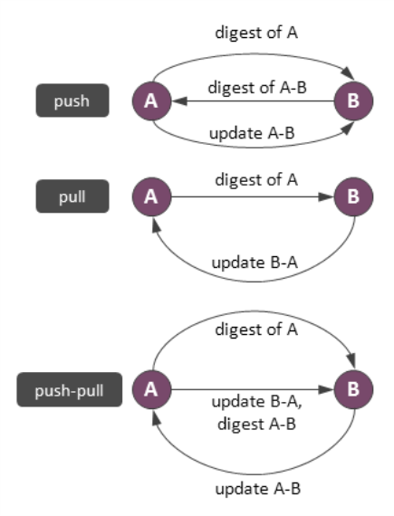
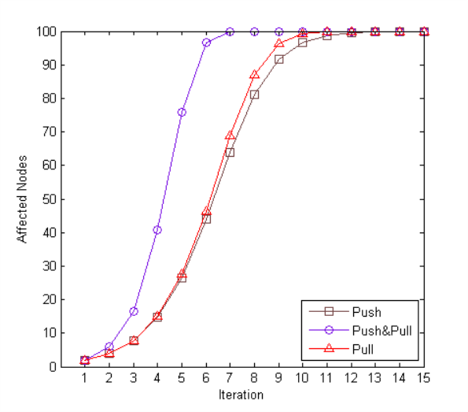

#分布式系统技术系列--Gossip算法

有许多节点，每条数据会在其中的若干的节点上面存有副本。每个节点都可以单独处理更新请求，每个节点定期和其他节点同步状态，如此一段时间之后所有的副本都会趋向一致。同步过程是怎样进行的？同步何时开始？怎样选择同步的对象？怎么交换数据？我们假定两个节点总是用较新版本的数据覆盖旧的数据或者两个版本都保留以待应用层处理。

这个问题常见于数据一致性维护和集群状态同步（如集群成员信息传播）等场景。虽然引入一个监控数据库并制定同步计划的协调者可以解决这个问题，但是去中心化的数据库能够提供更好的容错性。去中心化的主要做法是利用精心设计的传染协议，这种协议相对简单，但是提供了很好的收敛时间，而且能够容忍任何节点的失效和网络隔离。尽管有许多类型的传染算法，我们只关注反熵协议，因为NoSQL数据库都在使用它。

这里的反熵协议就是Gossip算法，Gossip算法如其名，灵感来自办公室八卦，只要一个人八卦一下，在有限的时间内所有的人都会知道该八卦的信息，这种方式也与病毒传播类似，因此Gossip有众多的别名“闲话算法”、“疫情传播算法”、“病毒感染算法”、“谣言传播算法”。但Gossip并不是一个新东西，之前的泛洪查找、路由算法都归属于这个范畴，不同的是Gossip给这类算法提供了明确的语义、具体实施方法及收敛性证明。

Gossip算法又被称为反熵（Anti-Entropy），熵是物理学上的一个概念，代表杂乱无章，而反熵就是在杂乱无章中寻求一致，这充分说明了Gossip的特点：在一个有界网络中，每个节点都随机地与其他节点通信，经过一番杂乱无章的通信，最终所有节点的状态都会达成一致。每个节点可能知道所有其他节点，也可能仅知道几个邻居节点，只要这些节可以通过网络连通，最终他们的状态都是一致的。要注意到的一点是，即使有的节点因宕机而重启，有新节点加入，但经过一段时间后，这些节点的状态也会与其他节点达成一致，也就是说，Gossip天然具有分布式容错的优点。

Gossip是一个带冗余的容错算法，更进一步，Gossip是一个最终一致性算法。虽然无法保证在某个时刻所有节点状态一致，但可以保证在”最终“所有节点一致，”最终“是一个现实中存在，但理论上无法证明的时间点。因为Gossip不要求节点知道所有其他节点，因此又具有去中心化的特点，节点之间完全对等，不需要任何的中心节点。实际上Gossip可以用于众多能接受“最终一致性”的领域：失败检测、路由同步、Pub/Sub、动态负载均衡。但Gossip的缺点也很明显，冗余通信会对网路带宽、CUP资源造成很大的负载，而这些负载又受限于通信频率，该频率又影响着算法收敛的速度，后面我们会讲在各种场合下的优化方法。

Gossip假定同步会按照一个固定进度表执行，每个节点定期随机或是按照某种规则选择另外一个节点交换数据，消除差异。有三种反风格的反熵协议：推，拉和混合。推协议的原理是简单选取一个随机节点然后把数据状态发送过去。在真实应用中将全部数据都推送出去显然是愚蠢的，所以节点一般按照下图所示的方式工作。

节点A作为同步发起者准备好一份数据摘要，里面包含了A上数据的指纹。节点B接收到摘要之后将摘要中的数据与本地数据进行比较，并将数据差异做成一份摘要返回给A。最后，A发送一个更新给B，B再更新数据。拉方式和混合方式的协议与此类似，就如上图所示的。
反熵协议提供了足够好的收敛时间和扩展性。下图展示了一个在100个节点的集群中传播一个更新的模拟结果。在每次迭代中，每个节点只与一个随机选取的对等节点发生联系。

可以看到，拉方式的收敛性比推方式更好，这可以从理论上得到证明[7]。而且推方式还存在一个“收敛尾巴”的问题。在多次迭代之后，尽管几乎遍历到了所有的节点，但还是有很少的一部分没受到影响。与单纯的推和拉方式相比， 混合方式的效率更高，所以实际应用中通常使用这种方式。反熵是可扩展的，因为平均转换时间以集群规模的对数函数形式增长。

尽管这些技术看起来很简单，仍然有许多研究关注于不同约束条件下反熵协议的性能表现。其中之一通过一种更有效的结构使用网络拓扑来取代随机选取。在网络带宽有限的条件下调整传输率或使用先进的规则来选取要同步的数据。摘要计算也面临挑战，数据库会维护一份最近更新的日志以有助于摘要计算。

Gossip是一种去中心化、容错而又最终一致性的绝妙算法，其收敛性不但得到证明还具有指数级的收敛速度。使用Gossip的系统可以很容易的把Server扩展到更多的节点，满足弹性扩展轻而易举。唯一的缺点是收敛是最终一致性，不适用那些强一致性的场景，比如2pc。