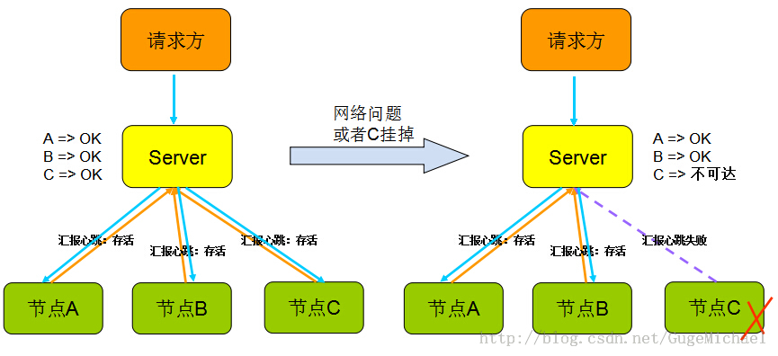
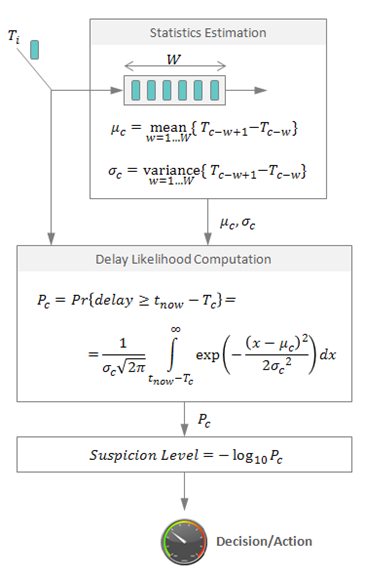

心跳顾名思义，就是以固定的频率向其他节点汇报当前节点状态的方式。收到心跳，一般可以认为一个节点和现在的网络拓扑是良好的。当然，心跳汇报时，一般也会携带一些附加的状态、元数据信息，以便管理。故障检测是任何一个拥有容错性的分布式系统的基本功能,而实际上所有的故障检测协议都基于心跳通讯机制，原理很简单，被监控的组件定期发送心跳信息给监控进程（或者由监控进程轮询被监控组件），如果有一段时间没有收到心跳信息就被认为失效了。

心跳用于故障检测示意如下图所示 ，当Server没有收到节点C发送的心跳汇报时，Server认为节点C失联。然而失联并不意味着节点C故障，也有可能是Server与节点C之间链路出现故障或闪断。所以心跳不是万能的，收到心跳可以确认ok，但是收不到心跳却不能确认节点不存在或者挂掉了，因为可能是网络原因倒是链路不通但是节点依旧在工作。所以切记，”心跳“只能告诉你正常的状态是ok，它不能发现节点是否真的死亡，有可能还在继续服务。

  在分布式系统中，用心跳实现故障检测有一些要求和约束：
自适应。故障检测应该能够应对暂时的网络故障和延迟，以及集群拓扑、负载和带宽的变化。但这有很大难度，因为没有办法去分辨一个长时间没有响应的进程到底是不是真的失效了，因此，故障检测需要权衡故障识别时间（花多长时间才能识别一个真正的故障，也即一个进程失去响应多久之后会被认为是失效）和虚假警报率之间的轻重。这个权衡因子应该能够动态自动调整。
灵活性。乍看上去，故障检测只需要输出一个表明被监控进程是否处于工作状态的布尔值，但在实际应用中这是不够的。我们来看参考资料[12]中的一个类似MapReduce的例子。有一个由一个主节点和若干工作节点组成的分布式应用，主节点维护一个作业列表，并将列表中的作业分配给工作节点。主节点能够区分不同程度的失败。如果主节点怀疑某个工作节点挂了，他就不会再给这个节点分配作业。其次，随着时间推移，如果没有收到该节点的心跳信息，主节点就会把运行在这个节点上的作业重新分配给别的节点。最后，主节点确认这个节点已经失效，并释放所有相关资源。
可扩展性和健壮性。失败检测作为一个系统功能应该能够随着系统的扩大而扩展。他应该是健壮和一致的，也即，即使在发生通讯故障的情况下，系统中的所有节点都应该有一个一致的看法（即所有节点都应该知道哪些节点是不可用的，那些节点是可用的，各节点对此的认知不能发生冲突，不能出现一部分节点知道某节点A不可用，而另一部分节点不知道的情况）。
那么我们常用的心跳机制有哪些实现呢？

（1）传统的周期检测心跳机制。其检测方法是设定一个超时时间T，只要在T之内没有接收到对方的心跳包便认为对方宕机，方法简单有效，使用比较广泛。在传统方式下，目标主机会每间隔t秒发起心跳，而接收方采用超时时间T(t<T)来判断目标是否宕机，接收方首先要非常清楚目标的心跳规律（周期为t的间隔）才能正确设定一个超时时间T，而T的选择依赖当前网络状况、目标主机的处理能力等很多不确定因素，因此在实际中往往会通过测试或估计的方式为T赋一个上限值。上限值设置过大，会导致判断“迟缓”，但会增大判断的正确性；过小，会提高判断效率，但会增加误判的可能性。由于存在网络闪断、丢包和网络拥塞等实际情况，在工程实践中，一般认为连续多次丢失心跳才可认定故障发生。

（2）累计失效检测机制。随着网路负载的加大，Server心跳的接收时间可能会大于上限值T；但当网络压力减少时，心跳接收时间又会小于T，如果用一成不变的T来反映心跳状况，则会造成判断”迟缓“或误判。累计失效检测可以较好的解决这一问题，所谓的累计失效检测算法基本工作流程如下：

- 对于每一个被监控资源，检测器记录心跳信息到达时间Ti。
- 计算在统计预测范围内的到达时间的均值和方差。
- 假定到达时间的分布已知（下图包括一个正态分布的公式），我们可以计算心跳延迟（当前时间t_now和上一次到达时间Tc之间的差值） 的概率，用这个概率来判断是否发生故障，可以使用对数函数来调整它以提高可用性。在这种情况下，输出1意味着判断错误（认为节点失效）的概率是10%，2意味着1%，以此类推。

心跳机制除了用于检测节点故障检测之外，还可用于服务故障的检测，例如Client端定期的发起一些无损的业务请求，Server收到处理后，返回ACK，通过收到的ACK，Client可以感知Server当前服务是否运转正常。