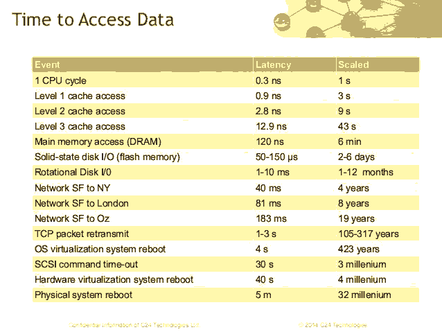

#性能优化的首要法则

　　大部分人需要他们的系统运行得更快，那么从哪里开始呢？大部分profiler工具都有内存跟踪 CPU跟踪，既然我们想让我们的程序跑得更快，那当然应该是盯着CPU了，错，首要法则是应该盯着内存，是内存中对象分配。

　　你首先应该是尽可能地降低对象分配，虽然我们知道对象分配非常快，那么为什么这么快还会拖慢我们的应用呢？为什么我们需要最小化我们的对象分配呢？

1.对象分配将压力加在了垃圾回收器，因为有更多对象是短生命的，你的垃圾回收器就工作得越多，这样就会导致系统减慢。

2.它会填满你的CPU缓存，因为垃圾回收强迫它们flush，将stack推入更高的L2和L3缓存，，然后推入主内存来获取数据，看看下面的各种设备时间延迟图，即使对象分配很快，也会引起Cache丢失，浪费很多CPU循环，降低了程序速度。

3.首先从容易的开始做，通过最容易的是降低分配，比如使用缓存，改变分配可以完全改变你应用程序的性能，比任何算法的改变都效果显著，后者有可能是浪费时间。

4.Profiler会撒谎，在CPU跟踪上也许Profiler会搞错，但是关于对象分配就不会了。

5.高的对象分配通常是代码坏味道，超过一定限度的对象分配会导致算法问题。

 