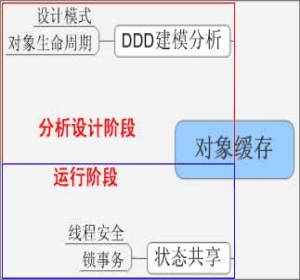

#内存缓存(in-memory cache)

　当建立一个大型Java应用时，引起性能问题大部分是延迟，延迟是指请求和响应之间的时间差，在一个分布式Java系统中引起延迟的原因有：
　

- 从磁盘上加装数据的IO延迟
- 跨网络加装数据的IO延迟。
- 在分布式锁上的资源争夺。
- 垃圾回收引起的暂停。

　　典型Ping时间是：本地机器是57µs；局域网是300 µs；从伦敦到纽约是100ms；对于1Gb网络，网络数据传输是每秒25MB – 30MB。对于10GB网络是每秒250MB – 350MB。使用SATA 3.0接口的SSD硬盘数据传输是每秒500-600MB。如果你有1G以上数据需要处理，磁盘延迟会严重影响应用性能。

　　硬件上最低延迟是内存，典型的内存缓存是每秒3-5 GB，能够随着CPU扩展。如果你有两个处理器，你就能每秒10GB，如果有4CPU就能获得 20GB. 有一个内存基准测试称为STREAM (http://www.cs.virginia.edu/stream/) 是测试许多计算机的内存吞吐量，一些在大量CPU帮助下能够实现每秒TB级别的吞吐量。

因此可以总结如下：

- 内存是快的: 为了高性能，你需要在内存中处理数据。
- 网络是慢的: 通过网络传输数据会严重影响性能，包括数据库连接池。

　　在许多应用中，应用的快速性能与数据实时更新需要寻找一个平衡点，有时你需要大胆地使用缓存，但是你可能会发现有旧脏数据现象发生，当然可以再抓取更新数据，但是可能会牺牲一些性能，你能，你可以鱼和熊掌兼得，那么就要花费购买更多硬件，增加软件的复杂性。

　　内存缓存原来作用是提高数据库访问性能。但是缓存不是数据库遮羞布，架构上缓存引入有着重要意义：状态对象：数据库的替代者。

　　缓存实际是内存，将状态置于内存而不是数据库，不但性能提升，还提高软件的可伸缩性和扩展性，直至轻松发展为分布式系统或云计算，这种缓存称为内存缓存(in-memory cache)或称 数据网格In-Memory-Data-Grid (IMDG)；Java EE 7引入分布式 弹性缓存Elastic Caching ，作为其云核心战略的一部分。 云计算是一种计算和存储分离的模型，云计算本质是分布式可伸缩的内存计算，可见Amazon弹性缓存介绍。

　　当我们将DDD领域模型加载到内存中以后，我们就不再面向关系数据库中数据表编程，而是真正直接面向模型对象编程。Java内存模型优点：基于内存的并发模型，多线程机制，大量线程安全型库包支持 基于内存的并发机制，粒度灵活控制，灵活度高于数据库锁。 多核并行计算模型 基于线程的异步模型(Domain Events)。

　　Twitter从Ruby转向JAVA的实践证明：Cache缓存 + JVM微调是Java/JVM的核心竞争力，这也是最容易被我们忽视的，因为很多使用Java系统(包括Spring + Hibernate)只是当作SQL语句的包装器来使用，负载主要集中在数据库上，根本不会使用In-memory Cache。

　　Jdon认为对象缓存恰好是领域模型和Java内存模型之间的衔接物，通过引入缓存，将领域模型落实到计算机平台上，如下图，基于此理念JdonFramework特点就是DDD + Cache，而Spring 3才刚刚加入缓存，两种框架相比可见关键性方向的不同：
　　
　　
