#In-Stream大数据处理模式

来自In-Stream Big Data Processing一文总结了当前大数据实时处理的通用设计和模式，主要是Storm, Cassandra, Kafka组合，也包括LinkedIn的Samza。

有关批数据处理(batch-oriented data processing:以Hadoop为基础的Hive或Pig等 )的问题和缺点大家已经意识到了，实践中需要实时查询和in-stream处理之类实时大数据处理，由此应运而生了Twitter’s Storm, Yahoo’s S4, Cloudera’s Impala, Apache Spark, 和 Apache Tez。

这些In-Stream处理技术是瞄准每天80亿的事件数据，提供容错和严格的事务，保证任何一个事件不丢失也不重复，这样的系统如果基于Hadoop批处理架构会带来高延迟和高成本维护，这就需要我们从更高层次抽象和总结出典型的模式。

高层次抽象图如下：

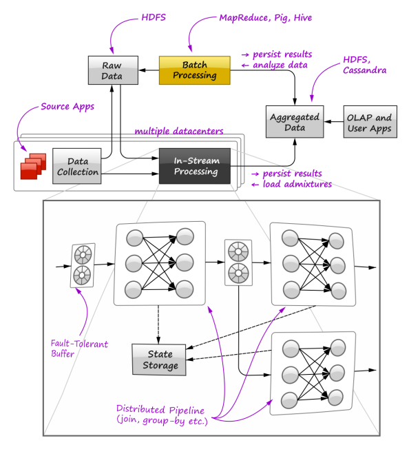

这张图主要表达了in-stream实时处理和批处理如何结合在一起，实现和OLAP接口，以供用户查询使用(banq注：类似Lambda架构)，图中黄色部分代表以Hive为基础的Hive Pig批处理，而以Storm/Samza为代表的in-stream处理是黑色部分，这两条不同路线汇总的数据最后聚合在一起，供用户查询。

该图放大了in-stream处理内部细节，主要由容错Buffer 分布式的pipeline 和中间状态保存三个部分组成。

该文提出了Distributed Query Processing分布式查询处理，认为可以结合传统关系数据库和in-stream以及批处理三个不同架构于一体，统一提供对外查询接口。如下图：

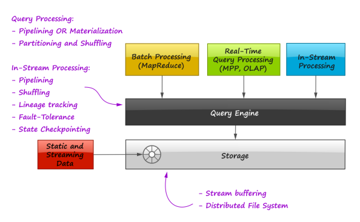

在这个查询引擎中，可以抽象出三者共有的两个处理模式：

- pipelining(管道线)
- Partitioning(分区) 和 Shuffling(洗牌)

下面谈谈在分区情况下的数据洗牌分配：

分布式并行查询处理必须直面数据分区，数据分区才能将一个大数据集分成多个片段喂给独立处理器进行处理，因此一个查询处理可能需要由很多步骤组成，每个步骤都有自己的有关分区策略，数据重新分配洗牌将频繁不断在进行。

分布式处理的joins操作因此并不是很容易实现，每个分区都有自己的join算法(e.g. nested-loop join or sort-merge join or hash-based join)，最后的结果从这些独立的处理器处理后合并。

根据Join有两种分区策略：

- Disjoint data partitioning 非Join不相交的数据分区
- Divide and broadcast join 切分和广播的join

Disjoint data partitioning比较容易理解，将数据分配到不同的服务器分区，数据没有重叠，每个分区处理器执行自己的Join策略，最后汇聚在一起。

如下图：根据Key的取模方式分配数据，将具有相同值的R和S实现Join关联(类似SQL中join语句)，图中虚线代表数据分配洗牌。

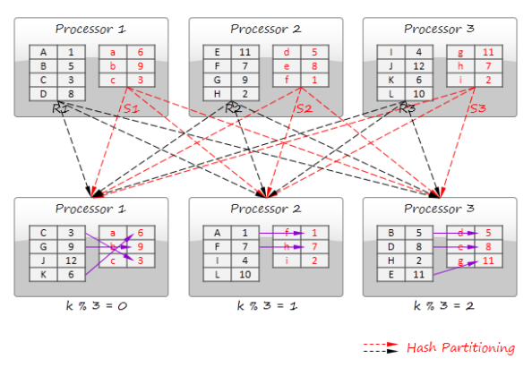

第二种分区策略：Divide and broadcast join 切分和广播的join

如下图，与上图不同的是，这次是只将S数据分配到不同分区处理器，使得每个分区中的S数据完整，这种情况当然需要考虑到S数据集不能太大。适合大数据集合与小关系数据集合。

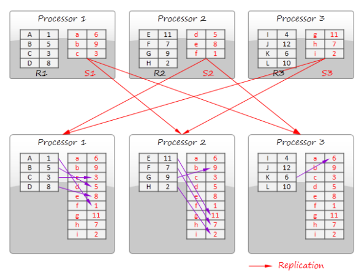

上面是Join的实现方式，下面谈谈GroupBy 的实现方式，这类似MapReduce范式：

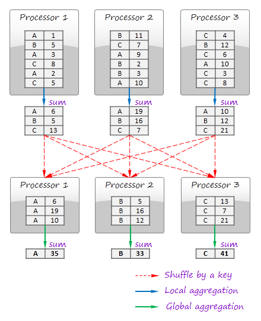

如上图，每个处理器处理自己SUM统计总数，然后通过数据洗牌，合并同类项，将A B C分别洗牌合并，最后得到最终A B C的统计总数。

这个案例中计算分两步：local aggregation 本地聚合和 global aggregation全局聚合，类似Map和Reduce两个操作。

下面看看第二个分区策略：Pipelining管道线
前面讨论的是在分布式查询处理系统使用算法仿照消息传递一样分配数据，但是有时在in-stream处理中并不有效: 因为一个查询中所有操作可能是链条状的，这样数据平滑流过整个管道，既没有任何一个操作应该堵塞等待一些数据输入，也不用处理输出将中间结果写到磁盘上，像排序这些操作就是这样特殊操作。(很显然，一个排序处理直到全部输入完成才有结果输出。), 在这样场合，管道线算法是适用的：

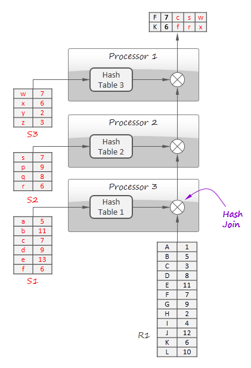

图中案例是一个哈希Join算法，用来将联接四种关系: R1, S1, S2, 和 S3，使用三个处理器 ，首先为建立一个S1, S2 和S3哈希表，
这样，流R1(称为tuples)一个接一个流过管道，从而和 S1, S2 和 S3发送关联，这是通过寻找所在处理器的哈希表完成的。这种方式适合数据流和静态数据的关联查询。

在关系数据库中，join关联操作能够使用管道线这一优点， 使用对称Symmetric的哈希join算法，对称Symmetric的哈希join算法是哈希Join的概括，正常的哈希Join至少需要一个输入完成才可以产生结果输出，因为输入用来建立哈希表, 而对称Symmetric的哈希join算法能够立即产生第一个结果，内部维持两个哈希表。如图：

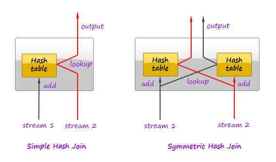

当一个 tuple进来后， joiner首先在其他流的哈希表寻找，如果匹配发现，输出 tuple将产生，然后这个tuple将被插入自己的哈希表。

许多场合下，使用LFU缓存保存数据流中最频繁的tuple，如果缓冲相比流动率足够大，或缓冲经常频繁被flush，可采取对称哈希Join ，在其他场合，简单的哈希Join通常足够用，因为缓冲时刻都是满的不会堵塞处理。

前面讨论了过去类似关系数据库的一些技术算法如何使用在分布式查询系统中，数据的分配洗牌和管道线(Shuffling and pipelining )在分布式环境下可以使用消息系统实现，但是在分布式系统中情况不是这么简单，需要更注重可靠性，因为分布式系统不像关系数据库那样只要重启就可以。

Stream Replay流重放是可以对流中事件进行重放，这能够保证数据处理的正确，即使管道线处理是容错的，一旦要重新部署系统，那么就需要重放管道线中新版本数据。当然还有其他原因。

重放可以通过持久化缓冲数据实现，如下图：

Kafka 消息队列是这样缓冲的很好实现，支持扩展性分布 容错提供高性能。这样消息系统设计要求是：

系统能够存储原始数据一段预配置时间。
系统能够取消产生结果的一部分。重放相应部分，然后产生新版本结果。
系统能够足够快能够及时倒回然后重放数据，还能赶得上正常数据流。

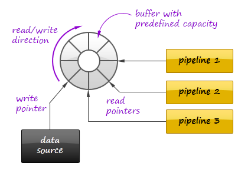

在一个流系统中，事件流通过串联的处理器，直至最终结果产生，每个输入事件产生一系列图谱式派生的子事件，为了确保可靠性，有必要在失败时确保整个图谱中事件全部被成功处理，然后才能重新启动处理。

下面是Twitter的 Storm如何跟踪事件的过程处理：

- 所有从源点，也就是处理图中第一个数据节点出发的事件，都有一个随机ID,对于每个源点，框架将维护一对数据[event ID -> signature], 对于每个初始事件，signature签名是由event ID初始的.

- 下游节点基于接受到的初始事件可能产生更多事件，每个事件都带有初始事件的那个随机 ID

-  如果事件被下一个节点成功接受和处理，这个节点将更新相应初始事件的签名，通过异或操作，将输入事件的ID和所有基于该输入事件产生的所有事件的ID进行异或操作，如下图，事件 01111 产生子事件 01100, 10010, 和 00010, 这样事件 01111的签名是11100 (= 01111 (initial value) xor 01111 xor 01100 xor 10010 xor 00010).

- 一个事件可能基于一个或多个输入事件产生的，因此它带有几个初始化事件信息，带有多个初始化事件的ID.

- 只要签名将变成0，事件成功被处理，当图谱中最后一个节点事件被成功处理，也就是再也没有事件发往下游， 框架自己将发出一个commit信息到源点。图中三部分

- 框架将定期遍历初始事件的表，寻找旧的未被commit的事件(也就是签名不为0的事件)，这些事件被认为是失败的，框架请求源点再重新播放处理它们。

- 注意的是签名的更新顺序并不是很重要，因为XOR异或操作本身的可替代性。....

- 上面的算法并不是严格的可靠，当签名可能因为不幸的ID结合突然变为0，64位的ID足够降低这种错误的发生...

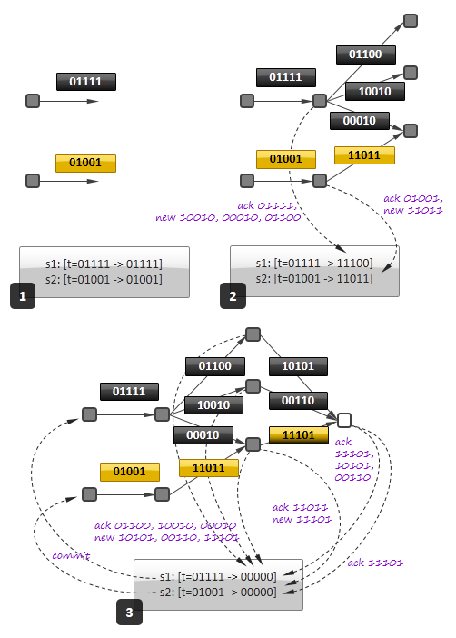

前面使用事件签名的方式是简单的，因为它是去除中心化，节点独立地发出确认信息，没有中央节点跟踪所有的来龙去脉，但是对于sliding windows滑动窗或其他类型的缓存，这种方式很难管理事务处理，每一个滑动窗片刻就有成百上千个事件，这是很难于管理是否完成确认的，因为很多事件可能还处于未确认状态，或者在持久保存中间状态，量太大了。

替代方案是 Apache Spark. 它认为最后的状态作为一个输入数据的函数，为了简化来路跟踪, 该框架以批次处理事件，这样结果就是批次的顺序，结果批次能被并行计算，如果计算失败，框架也只是简单返回它。

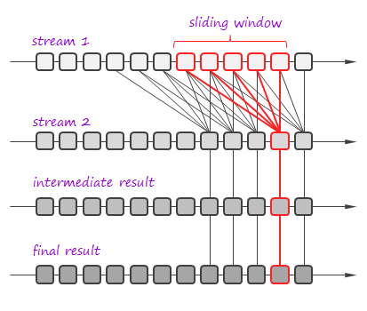

框架将两个流合并到一个滑动窗，结果经过更多处理阶段，框架认为输入流不是一个流，而是一系列批次，每个批次有一个ID，框架能够根据ID任何时刻获得它，这样流处理被一串串事务替代，每个事务都带有一组输入批次，用处理函数改变他们，然后持久一个结果。图中这样一个事务是用红色表达，如果事务失败，框架只是简单返回，关键是事务能够并行被执行。

这种简单而强大范式激活了中央式事务管理机制，提供一次消息处理的语义，既可以用于批处理也可适合流处理，因为它将数据看成一系列批次，而不考虑他们自然静态的流特性。

之前使用事件的签名来实现来路跟踪，以此确保分布式系统的可靠性，但是有两个问题：

- 在大多数场合，一次处理语义(exactly-once processing semantics)是必须的，比如如果一些消息传送两次导致对事件计数的管道线产生不正确结果。

- 在管道线中的节点在消息被处理以后，其计算状态必须被更新，如果节点出错，这个状态就丢失，有必要持久化它或复制它。

Twitter的 Storm框架使用如下协议纠正这些问题：

- 事件被分组进入一个个批次，每个批次有一个事务ID.这个ID是线性呈数字增长(e.g. the first batch has ID 1, the second ID 2, and so on). 如果管道线处理一个批失败，这个批将用同样事务ID再次发送一次。

- 首先，框架向管道线中节点告示，一个新的事务将开始，然后，框架发出一个批通过管道线，最后，如果所有节点都确认它们的状态更新，框架就宣布这个事务完成了。

- 框架确保 commit phases跨事务是全局有序的。事务2 永远不会在事务1之前被确认提交committed 这种确保机制是按如下状态更新逻辑实现的:

最后一个事务 ID 将和状态一起持久化，如果框架用持久化到数据库的ID请求确认提交当前事务，状态才能被修改，数据库中的一个计数器将被增加，假设事务有一个很强的次序，那么更新将一批接着一批地更新。

如果当前事务ID等同于持久化到数据库的ID值，节点将忽视确认提交，因为该批在重放。节点之前肯定已经处理过该批，已经更新过状态，但是事务也许因为管道线什么地方错误而出错。

强提交确认的次序对于完成一次处理语义exactly-once processing semantics是重要的，严格的处理顺序并不可行，因为管道线中经常发生空闲等待下游处理完成，这种情况可以通过并行处理然后序列化提交确认的方式得到缓解，如下图：

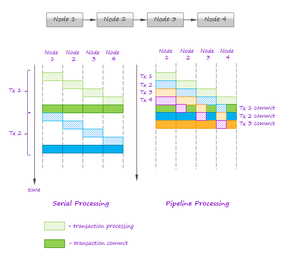