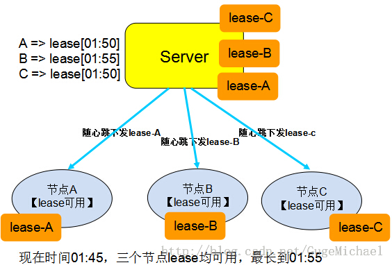
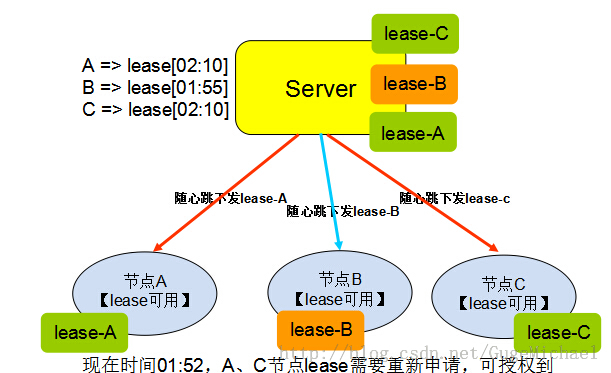

租约（lease）在英文中的含义是“租期”、“承诺”，在分布式中一般描述如下：

Lease 是由授权者授予的在一段时间内的承诺。
授权者一旦发出 lease，则无论接受方是否收到，也无论后续接收方处于何种状态，只要 lease 不过期，授权者一定遵守承诺，按承诺的时间、内容执行。
接收方在有效期内可以使用颁发者的承诺，只要 lease 过期，接收方放弃授权，不再继续执行，要重新申请Lease。
可以通过版本号、时间周期，或者到某个固定时间点认为Lease证书失效
关于Lease最经典的解释来源于Lease的原始论文<<Leases: An Efficient Fault-Tolerant Mechanism for Distributed File Cache Consistency>>：

```
    a lease is a contract that gives its holder specific rights over  
    property for a limited period of time
```
即Lease是一种带期限的契约，在此期限内拥有Lease的节点有权利操作一些预设好的对象。从更深 层次上来看，Lease就是一把带有超时机制的分布式锁，如果没有Lease，分布式环境中的锁可能会因为锁拥有者的失败而导致死锁，有了lease死锁会被控制在超时时间之内。

租约的示意如下图所示：





 那么租约机制在分布式中如何使用呢，我们罗列了以下三种使用场景供参考：
 
- 使用场景一：现有一个类似DNS服务的系统，数据的规律是改动很少，大量的读操作。客户端从服务端获取数据，如果每次都去服务器查询，则量比较大。可以把数据缓存在本地，当数据有变动的时候重新拉取。现在服务器以lease的形式，把数据和lease一同推送给客户端，在lease中存放承诺该数据的不变的时间，然后客户端就可以一直放心的使用这些数据(数据不发生变更)。如果有客户端修改了数据，则把这些数据推送给服务器，服务器会阻塞一直到已发布的所有lease都已经超时用完，然后后面发送数据和lease时，更新现在的数据。这里可以优化为当服务器收到数据更新需要等所有已经下发的lease超时的这段时间，直接发送让数据和lease失效的指令到客户端，减小服务器等待时间，如果并非所有的lease都失效成功，则退化为前面的等待方案(概率小)。 
 
- 使用场景二：现有一个系统，有三个角色，选主模块Manager，唯一的Master，和其他salver节点。slaver都向Maganer注册自己，并由manager选出唯一的Master节点并告知其他slaver节点。当网络出现异常时，例如Master和Manager之间的链路断了，Maganer认为Master已经死掉了，则会再选出一个Master，然而原来的Master对其他网络链路可能都还是正常的，原来的Master认为自己还是主节点，继续提供服务。此时系统中就出现了”双主“，俗称”脑裂“。解决这个问题的方式可以通过Lease，来规定节点可以当Master的时间，如果没有可用的Lease，则自动退化为Slaver。如果出现”双主“，原Master会因为Lease到期而放弃当Master，退化为Slaver，恢复了一个Master的情况。在某些场景下，双主是一定不能发生的，否则会导致分布式系统灾难性的后果。怎么保证呢？我们可以将Master自动失效租约设置为t，而Manager记录Master租约失效为T，只要保证T>t,则可以保证Manager选择新Master时，原Master已租约失效。实际工程实现时要考虑失效Master资源释放的时间。

- 使用场景三：众所周知，一般会采用Proxy的方式加速对Web资源的访问速度，而Proxy也是HTTP协议里面的一个标准组件，其基本原理就是对远程 Server上的资源进行Cache，Client在访问Proxy时如果所需的内容在Proxy Cache中不存在，则访问Server；否则直接把Cache中的内容返回给Client。通过Proxy既提高了用户体验，又降低了Server负 载。当然，一个Server会存在很多个Proxy。因此，保证Cache中的数据与Server一致成为Proxy Cache能正确工作的前提。之前，一般互联网数据不需要很强的一致性，但随着支付、股票等应用的发展，强一致性成为比不可少的要求，Lease就是解决这类强一致性的折中方案。在不需要强一致性的环境中，Cache只要每隔一段时间与Server同步一下即可，但在需要强一致性的环境这种做法不能满足需求。