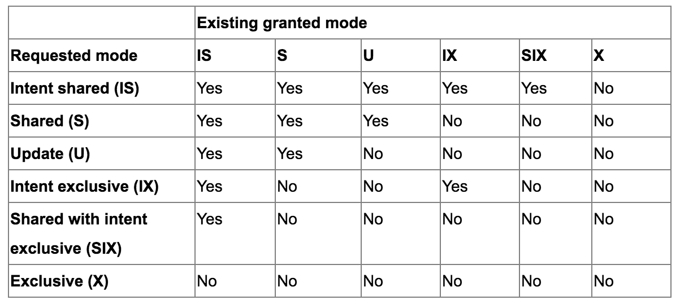

#层次锁

层次锁，更多地是在数据库设计中被提到，但也有少数分布式锁系统也实现这个概念。下面内容主要还是从数据库设计的角度来理解层次锁的概念。

###1. 事务锁
粗略说来，当执行SQL语句时数据库都会开启事务，在SQL执行完毕commit时，会把所有受影响数据写到磁盘文件并结束事务。在事务执行期间，为了保证事务的ACID，SQL所影响到的表、行等数据都会被不同程度的进行锁定，我们笼统称为“事务锁”。从使用者的角度来看，一般数据库都提供了表锁和行锁，其中行锁要比表锁粒度要细很多，被认为是支持高并发事务的关键。
但仅靠表锁和行锁是不够的，比如一个事务进行了行锁定，而另一个事务需要表锁定，那如何判断表锁定是否可以成功？同样，一个事务锁定了某些行，而另一事务需要读取这些行，是否允许读取？当考虑到不同的数据库操作和隔离级别时，锁的实现会变得非常复杂。
###2. 锁的类型
有一个关键问题是，数据库锁用来锁什么，从数据库实现上来说是锁数据库内部的数据库结构，因为各数据库实现不一，因此锁的内容也就有所区别。对Oracle来说存在表、行、回滚段、Redolog等结构；SQLServer存在表、页、行等结构，这些结构在逻辑上存在上下级关系，比如SQLServer中，每个表的数据有多个页构成，而页中有包含了多行的内容，而一般认为行没有下级数据结构，为事务操作的最小单位。既可以对表，也可以对页、行对象加锁，抽象一点，称这些能加锁的对象为Node。
数据库中存在下面类型的锁：

- 共享锁（S：Share）
共享锁也即读锁，多个事务可以同时读某个Node上的数据，但会阻塞写。其目的是提高数据读取的并发性，如果加锁的Node为行，则得到熟知的行锁。但共享锁可以加在任意的Node结构上，并不仅限于行。
好像每次执行SELECT语句都对行加共享锁，理解起来非常容易。其实考虑到并发原因，很多数据库并没有读取时便对数据行加共享锁，像Oralce、Mysql都使用了回滚段的设计方式，从而保证读取数据是“无锁”的；但对数据行的索引可能加了共享锁。
- 排他锁（X：Exclusive）
排他锁即写锁，某个时刻仅有一个事务能拥有某个Node的排他锁，其目的是保证更新的原子性，即实现ACID中的A。与共享锁一样，排他锁也可加在任何一个Node上，如果加在表上则为锁定整张表，加在行上则锁定该行。
排他锁的场景就比较多了，SELECT * FROM T FOR UPDATE便会触发行锁；而LOCK TABLE T则会触发表锁
- 更新锁（U：Update）
更新锁在SQLServer的文档中提到的比较多，根据微软介绍，更新锁是为了解决一种常见的死锁场景：
1.事务A获取行的共享锁
2.事务B获取行的共享锁
3.事务A转换共享锁为排他锁（因事务B持有共享锁，故等待）
4.事务B也期望转为共享锁为排他锁，等A。导致死锁
为解决该问题SQLServer引入更新锁，同一时刻只有一个事务可以持有更新锁，如果该事务随后修改了数据则更新锁转换为排他锁；否则转换为共享锁。即共享锁是先“持有”后转换。
一般我们执行SELECT * FROM T FOR UPDATE时便会触发更新锁。
- 意向锁（Intent Lock）：

上面三种锁是描述了某个Node被修改时的锁类型，但因为Node存在上下级关系，但Node被加锁时，我们需要评估上级Node的加锁情况，比如当给行加各种锁的时候，表的加锁情况是神马？
之所以这样做的原因是因为存在一个需求

- 事务A给表中的某些行加了共享、排他锁，而事务B希望锁住整张表（比如用户显式调用LOCK TABLE T）
- 事务B能否给整张表加排他锁需要检查表各行的加锁情况，若某些行已经加了排他锁，则不能给整张表加排他锁。就是表锁依赖行锁。


若逐行去检查，在数据量非常大的时候性能会有巨大的损伤，因此引入一种能描述表被加锁情况的锁类型---意向锁。当程序对Node进行加锁操作时，需首先声明上级Node的锁类型。比如，对行加排他锁之前需对表加意向排他锁。

这样事务A在更新数据之前会对表加意向排他锁，而事务B在加排他锁之前发现A加的意向排他锁，所以必须等待A完成，从而避免了逐行检查的问题。

从下层节点来说，意向锁是对所有下级Node加锁情况的整体说明；但从上层Node来说，意向锁描述的是其下层Node正在被加某种锁（比如排他锁），或说下层Node有加某种锁的意向，这样正是“意向"一词的由来。

意向锁与共享锁、排他锁、共享锁不同的时，只能加在存在下级Node的Node对象上，比如可以加在表、页上，但不能加在行上，因为行是事务加锁的基本元，不存在有”意向“的下级Node。


意向锁具体有分：意向共享锁（Intent Share）、意向排他锁（Intent Exclusive）、共享意向排他锁（Share Intent Exclusive），下面逐一说明

- 意向共享锁（IS：Intent Share）
表明事务正在读该Node的下层数据（非全部），并且下层Node被加了共享锁
比如若执行SELECT语句，在SQLServer中，表、页、索引都会被加意向共享锁
- 意向排他锁（IX：Intent Exclusive）
表明事务正在修改该Node的下层数据（非全部），并且下层Node被加排他锁
在执行UPDATE、SELECT FRO UPDATE、DELETE、INSERT语句是便是这种情况
- 共享意向排他锁（SIX：Share Intent Exclusive）
表明事务正在读取该Node的全部下层数据，并且下层Node被加排他锁（非全部）。比如事务对表加了SIX，对页加了IX，对行加了X，每个Node在同一时刻仅能有一个SIE。
- 通过显式调用LOCK TABLE + SRX可获得该效果

###3. 相容矩阵
因为对同一Node可能存在多个事务期望对该Node加不同的锁，这就需要列出锁直接的相容性，只有相容的锁才允许被同时加在同一Node上，否则后面事务就需要等待。
下表直接引用自微软网站：http://msdn.microsoft.com/en-us/library/aa213041(v=sql.80).aspx




###4.层次锁、区间锁、锁膨胀
因为意向锁的引入，导致锁之间也存在上下级关系：比如表的锁为SIX、页的锁为：IX、行的锁为：X，这样对某个Node及下级Node来说，存在着层次锁的概念，也即多粒度锁。
各事务可以使用不同粒度的锁与Node及其下级Node进行交互，从而提高事务的并发性。

还有一类锁，在SQLServer中称为“区间锁”（Key-Range），在Mysql中称为”间隙锁“（Gap Lock），主要应对下面场景：
假如事务执行:SELECT * FROM T WHERE ID>10 AND ID<20，在READ_REPEATABLE的隔离级别下，无论事务执行都少次都希望能返回相同的结果，也即不能在10<ID<20之间更新任何数据，这就需要锁住(10,20)这个区间，这便是区间锁的由来。
与上面列出的锁类型不同的是，这类锁物理上并不存在，只是有前面几种锁类型组合出的逻辑锁。

在Oracle、SQLServer中，当行锁多到一定的程度后，为了降低锁带来的开销，数据库引擎会把行锁升级为表锁（或页锁），但在Mysql中不存在这个问题，因为Mysql说他们的行锁算法极度节省空间。

5. 总结
本文主要罗列了一些数据库锁的概念，这些概念中有些并不通用，不是在所有数据库中都存在，主要目的是为了因此层次锁的概念，层次锁的实现在各数据库中也差异很大。
层次锁的优点是可以通过多粒度锁的方式锁定对象，从而为高并发带来极佳的性能。

```
【参考资料】
http://msdn.microsoft.com/en-us/library/aa213041(v=sql.80).aspx
http://database.51cto.com/art/200804/69552.htm
http://blog.csdn.net/chen77716/article/details/6742128
http://www.devx.com/tips/Tip/13134
```