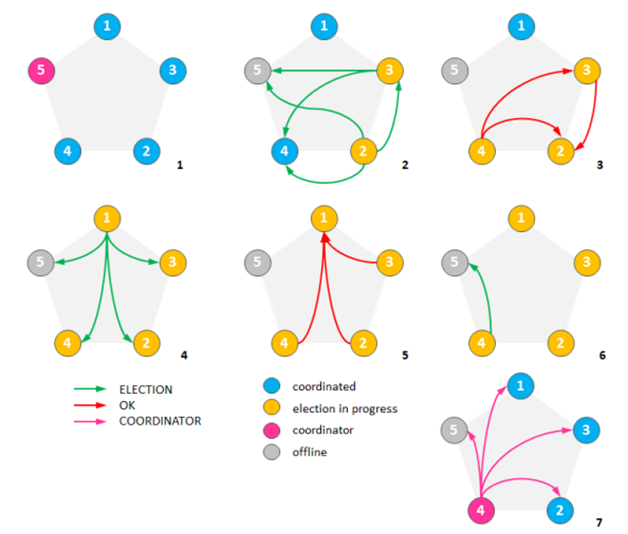
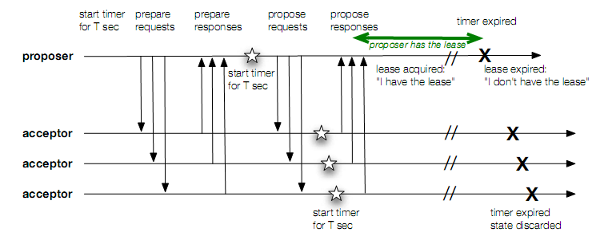

# 分布式系统技术系列--选主算法

普通选举算法与分布式选举算法最大的区别在于对于“脑裂”问题的处理，普通选举算法可以任意制定规格，例如选举节点号较小或较大的节点做主，选择某个版本号较大的节点做主，只要保证选举的结果是唯一的，无二义性的，都是有效的选举算法。然而分布式选举算法不同，分布式选举算法面临最核心的问题是如何处理网络隔离问题，要保证在网络隔离的场景下，算法有且只有一个主的产生。

那么，分布式系统中选举的背景是什么呢？系统中有很多应用场景要类似主从架构，主服务器(Master)对外提供服务，从服务器(Salve)热备份，不提供服务但随时活着，如果Master出现宕机或者网络问题，Slave即可接替Master对外服务，并由Slave提升为Master(新主)。典型的多节点共存，但只能同时存在一个主，并且所有节点的状态能统一维护。

下面介绍三种分布式系统中常用的三种选举算法：

（1）Bully算法

Bully 算法是一种相对简单的协调者竞选算法。MongoDB 用了这个算法来决定副本集中主要的那一个。Bully 算法的主要思想是集群的每个成员都可以声明它是协调者并通知其他节点。别的节点可以选择接受这个声称或是拒绝并进入协调者竞争。被其他所有节点接受的节点才能成为协调者。节点按照一些属性来判断谁应该胜出。这个属性可以是一个静态ID，也可以是更新的度量像最近一次事务ID（最新的节点会胜出）。

下图的例子展示了bully算法的执行过程。使用静态ID作为度量，ID值更大的节点会胜出：

最初集群有5个节点，节点5是一个公认的协调者。
假设节点5挂了，并且节点2和节点3同时发现了这一情况。两个节点开始竞选并发送竞选消息给ID更大的节点。
节点4淘汰了节点2和3，节点3淘汰了节点2。
这时候节点1察觉了节点5失效并向所有ID更大的节点发送了竞选信息。
节点2、3和4都淘汰了节点1。
节点4发送竞选信息给节点5。
节点5没有响应，所以节点4宣布自己当选并向其他节点通告了这一消息。

 协调者竞选过程会统计参与的节点数目并确保集群中至少一半的节点参与了竞选。这确保了在网络隔离的情况下只有一部分节点能选出协调者（假设网络中网络会被分割成多块区域，之间互不联通，协调者竞选的结果必然会在节点数相对比较多的那个区域中选出协调者，当然前提是那个区域中的可用节点多于集群原有节点数的半数。如果集群被隔离成几个区块，而没有一个区块的节点数多于原有节点总数的一半，那就无法选举出协调者，当然这样的情况下也别指望集群能够继续提供服务了）。
 
（2）环算法

（1）假设进程按照物理或者逻辑顺序进行排序，那么进程都知道它的后继者当任何一个进程注意到协调者不工作时，它构造一个带有自己的进程号的election消息，并将消息发送给后继者。如果后继者崩溃了，发送者沿着此环跳过它的后继者发送给下一个进程，或者再下一个进程。直到找到一个正在运行的进程。  

（2）在每一步中，后继的发送者将自己的进程编号也加入到消息中，使自己也成为协调者候选人之一。  

（3）最终消息返回到发起这次选举的进程，当发起者收到一条包含自己进程编号的消息时，识别出来。此时消息编程coordinator消息，并再一次绕环运行，向所有进程通知谁是协调者（例如选择成员列表中进程号最大的那个)。 

（3）Paxos算法
    世上有很多选举算法，但最完美的莫过于Paxos，但把paxos用于master选举与用于value的选举有用众多不同之处，主要一点是二者执行频率不同。value选举需要频繁、高密度地执行paxos算法，每instance选举一个value。因此，原生的paxos算法无法满足高性能的要求；另一个问题是，paxos理论上存在活锁，lamprot推荐大家通过选举Leader避免这个问题。
所有的实现都指向一个Leader/Master，但Master的选举又该如何实现？如果继续采用paxos那性能和活锁又该如何解决？这个似乎是个递归问题，用paxos解决paxos遇到的问题。能实现吗？能，Keyspace的PaxosLease算法给出了答案。
    Master选举的过程是这样的：从众多的Node中选择一个作为Master，如果该Master一致alive则无需选举，如果master crash，则其他的node进行选举下一个master。选择正确性的保证是：任何时刻最多只能有一个master。
逻辑上Master更像一把无形的锁，任何一个节点拿到这个锁，都可成为master，所以本质上Master选举是个分布式锁的问题，但完全靠锁来解决选举问题也是有风险的：如果一个Node拿到了锁，之后crash，那锁会导致无法释放，即死锁。一种可行的方案是给锁加个时间（Lease），拿到锁的Master只能在Lease有效期内访问锁定的资源，在Lease timeout后，其他Node可以继续竞争锁，这就从根本上避免了死锁。Master在拿到锁后，如果一直alive，可以向其他node”续租“锁，从而避免频繁的选举活动。
具体的选举过程如下：
    
1、prepare request：广播探查lease指令  

2、prepare response：回复lease状态  

3、propose request： 检查收到的Respond回复，若多数派回复为空，发出Capture  
 lease指令，当然，要附带上本机ID。然后启动定时器，超时时间T  
 
4、propose response：接收Capture Lease，Overwrite原lease状态，回复OK  

5、Check & Ack： 若收到多数派的OK回复，那么在超时时间T结束之前，就可以确信自己得到lease了  

注意第四步，是Overwrite原lease状态，还有第三部，若多数派回复为空条件不成立，就要回到第一步重新开始。图示如下：

还有一个问题，replica宕机重启后，需要等待M>T的时间才能有资格开始竞选master，这也是为了安全性的保证。因为replica并不保存lease相关状态，这是一个diskless的算法。既然是lease，master就得在lease到期之前续约，续约的步骤和上边的5步类似，就是第三步，原本是检查是否有多数派lease为空，改为检查是否有多数派lease或者为空，或者等于自己的ID。  

这个选举算法，叫做PaxosLease算法，但是本质上和Paxos算法是完全不同的，只不过也用了Paxos算法的两阶段提交形式，同时为了保证两阶段提交的原子性，加入编号机制。但它同样有Paxos算法的活锁问题。但是，和最开始提出的简单的选举算法比，”死锁“问题已经完全消除了。这个算法在一个开源的分布式数据库KeySpace中得到了应用。
