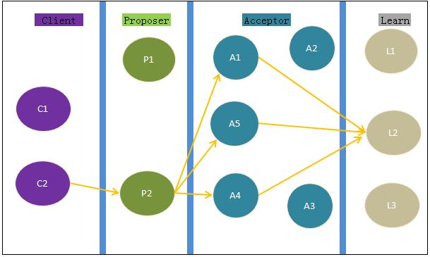

#Paxos算法3-实现探讨

前两篇Paxos算法的讨论，让我们对paxos算法的理论形成过程有了大概的了解，但距离其成为一个可执行的算法程序还有很长的路要走，原因是很多的细节和错误未被考虑。Google Chubby的作者说，paxos算法实现起来远没有看起来简单，原因是paxos的容错仅限于server crash这一种情况，但在实际工程实现时要考虑磁盘损坏、文件损坏、Leader身份丢失等诸多的错误。
 
####1. Paxos各角色的职能
在paxos算法中存在Client、Proposer、Proposer Leaer、Acceptor、Learn五种角色，可精简为三种主要角色：proposer、acceptor、learn。角色只是逻辑上存在的，在实际实现中，节点可以身兼多职。
在我们的讨论中，我们先假定没有Proposer Leader这一角色，在不考虑活锁的情况下，如果算法过程正确，那有Leader角色的算法过程肯定也正确。
 
除了五种角色，还有三个重要的概念：instance、proposal、value，分别代表：每次paxos选举过程、提案、提案的value
当然，还有4个关键过程：  

- (Phase1)：prepare
- (Phase1)：prepare ack
- (Phase2)：accept
- (Phase2)：accept ack 

对acceptor来说，还蕴含是着promise、accept、reject三个动作。
先上一幅图，更直观地对几种角色的职能加以了解（各角色的具体职能参考Lamport的论文就足够了）：

上图不是非常严格，仅为表现各角色之间的关系。

####2. Proposer
在Proposer、Acceptor、Learn中均涉及到proposal的编号，该编号应该有proposer作出改变，对其他的角色是只读的，这就保证了只有一个数据源。当多个proposer同时提交proposal时，必须保证各proposer的编号唯一、且可比较，具体做法之前已经提到。这里还要强调一点的是，仅每个proposer按自己的规则提高编号是不够的，还必须了解“外面”的最大编号是多少，例如，P1、P2、P3（请参考：Paxos算法2#再论编号问题：编号唯一性）  

- P3的当前编号为初始编号2
- 当P3提交proposal时发现已经有更大的编号16（16是P2提出的，按规则：5*3+1）
- P3发起新编号时必须保证new no >16，按照前面的规则必须选择：5*3+2 = 17，而不能仅按自己的规则选择：1*3+2=5

这要求acceptor要在reject消息中给出当前的最大编号，proposer可能出现宕机，重启后继续服务，reject消息会帮助它迅速找到下一个正确编号。但是当多个acceptor回复各自不一的reject消息时，事情就变得复杂起来。
当proposer发送proposal给一个acceptor时，会有三种结果：  

- timeout：超时，未接收到aceptor的response
- reject：编号不够大，拒绝。并附有当前最大编号
- promise：接受，并确保不会批准小于此编号的proposal。并附有当前最大编号及对应的value  

在判断是否可以进行Phase2时的一个充分条例就是：必须有acceptor的多数派promise了当前的proposal。
下面分别从Phase1和Phase2讨论proposer的行为：
 
####Phase1-prepare：发送prepare到acceptor

Proposer在本地选择proposal编号，发送给acceptor，会收到几种情况的response：

(a). 没有收到多数派的回应
消息丢失、Server宕机导致没有多数派响应，在可靠消息传输(TCP)下，应该报告宕机导致剩余的Server无法继续提供服务，在实际中一个多数派同时宕机的可能性非常小。
 
(b). 收到多数派的reject
Acceptor可能会发生任意的错误，比如消息丢失、宕机重启等，会导致每个acceptor看到的最大编号不一致，因而在reject消息中response给proposer的最大编号也不一致，这种情况proposer应该取其最大作为比较对象，重新计算编号后继续Phase1的prepare阶段。
 
(c). 收到多数派的promise
根据包含的value不同，这些promise又分三种情况：
多数派的value是相同的，说明之前已经达成了最终决议
value互不相同，之前并没有达成最终决议
返回的value全部为null
全部为null的情况比较好处理，只要proposer自由决定value即可；多数派达成一致的情况也好处理，选择已经达成决议的value提交即可，value互不相同的情况有两种处理方式：
方案1：自由确定一个value。原因：反正之前没有达成决议，本次提交哪个value应该是没有限制的。
方案2：选择promise编号最大的value。原因：本次选举（instance）已经有提案了，虽未获通过，但以后的提案应该继续之前的，Lamport在paxos simple的论文中选择这种方式。

其实问题的本质是：在一个instance内，一个acceptor是否能accept多个value？约束P2只是要求，如果某个value v已被选出，那之后选出的还应该是v；反过来说，如果value v还没有被多数派accept，也没有限制acceptor只accept一个value。  
感觉两种处理方式都可以，只要选择一个value，能在paxos之后的过程中达成一致即可。其实不然，有可能value v已经成为了最终决议，但acceptor不知道，如果这时不选择value v而选其他value，会导致在一次instance内达成两个决议。  
会不会存在这样一种情况：A、B、C、D为多数派的promise，A、B、C的proposal编号，value为(1,1)，D的为(2,2)？就是说，编号互不一致，但小编号的已经达成了最终决议，而大编号的没有？  
设：小编号的proposal为P1，value为v1；大编号的proposal为P2，value为v2

- 如果P1选出最终决议，那么肯定是完成了phase1、phase2。存在一个acceptor的多数派C1，P1为其最大编号，并且每个acceptor都accept了v1；
- 当P2执行phase1时，存在多数派C2回应了promise，则C1与C2存在一个公共成员，其最大编号为P1，并且accept了v1
- 根据规则，P2只能选择v1继续phase2，也就是说v1=v2，无论phase2是否能成功，绝不会在acceptor中遗留下类似（2，2）这样的value  

也就是说，只要按照【方案2】选择value就能保证结果的正确性。之所以能有这样的结果，关键还是那个神秘的多数派，这个多数派起了两个至关重要的作用：  

- 在phase1拒绝小编号的proposal
- 在phase2强迫proposal选择指定的value  

而多数派能起作用的原因就是，任何两个多数派至少有一个公共成员，而这个公共成员对后续proposal的行为起着决定性的影响，如果这个多数派拒绝了后续的proposal，这些proposal就会因为无法形成新的多数派而进行不下去。这也是paxos算法的精髓所在吧。
 
####Phase2-accept：发送accept给acceptor
如果一切正常，proposer会选择一个value发送给acceptor，这个过程比较简单

#####accept也会收到2种回应：

(a). acceptor多数派accept了value
一旦多数派accept了value，那最终决议就已达成，剩下的工作就是交由learn学习并关闭本次选举(instance)。
 
(b). acceptor多数派reject了value或超时
说明acceptor不可用或提交的编号不够大，继续Phase1的处理。
 
proposer的处理大概如此，但实际编程时还有几个问题要考虑：  

- 来自acceptor的重复消息
- 本来超时的消息又突然到了
- 消息持久化  

其他2个问题比较简单，持久化的问题有必要讨论下。
持久化的目的是在proposer server宕机“苏醒”时，可以继续参与paxos过程。
从前面分析可看出，proposer工作的正确性是靠编号的正确性来保证的，编号的正确性是由proposer对编号的初始化写及acceptor的reject一起保证的，所以只要acceptor能正常工作，proposer就无须持久化当前编号。

###3. acceptor
 acceptor的行为相对简单，就是根据提案的编号决定是否接受proposal，判断编号依赖promise和accept两种消息，因此acceptor必须对接收到的消息做持久化处理。根据之前的讨论也知道，acceptor的持久化也会影响着proposer的正确性。  
 
 在acceptor对proposal进行决策的时候，还有个重要的概念没有被详细讨论，即instance。任何对proposal的判断都是基于某个instance，即某次paxos过程，当本次instance宣布结束（选出了最终决议）时，paxos过程就转移到下一个instance。这样会衍生出几个问题：  
 
- instance何时被关闭？被谁关闭？
- acceptor的行为是否依赖instance的关闭与否？
- acceptor的多数派会不会在同一个instance内对两个不同的value同时达成一致？  

根据1中对各角色职能的讨论，决议是否被选出是由learn来决定的，当learn得知某个value v已经被多数派accept时，就认为决议被选出，并宣布关闭当前的instance。与2中提到的一样，因为网络原因acceptor可能不会得知instance已被关闭，而会继续对proposer回答关于该instance的问题。也就是说，无论如何acceptor都无法准确得知instance是否关闭，acceptor程序的正确性也就不能依赖instance是否关闭。但acceptor在已经知道instance已被关闭的情况下，在拒绝proposer时能提供更多的信息，比如，可以使proposer选择一个更高的instance重新提交请求。  

当然，只要proposer根据2中提到的方式进行提案，就不会发生同一instance中产生两个决议的情况。
 
###4. learn
learn的主要职责是学习决议，但决议必须一个一个按顺序学，不能跳号，比如learn已经知道了100，102号决议，必须同时知道101时才能一起学习。只是简单的等待101号决议的到来显然不是一个好办法，learn还要去主动向acceptor询问101号决议的情况，acceptor会对消息做持久化，做到这一点显然不难。  
learn还要周期性地check所接收到的value，一旦意识到决议已经达成，必须关闭对应的instance，并通知acceptor、proposer等（根据需要可以通知任意多的对象）。  
learn还存在一个问题是，是选择一个server做learn还是选多个，假如有N个acceptor，M个learn，则会产生N*M的通信量，如果M很大则通信量会非常大，如果M=1，通信量小但会形成单点。折中方案是选择规模相对较小的M，使这些learn通知其他learn。  
paxos中的learn相对比较抽象，好理解但难以想象能做什么，原因在于对paxos的应用场景不清晰。一般说来有两种使用paxos的场景：  

- paxos作为单独的服务，比如google的chubby，hadoop的zookeeper
- paxos作为应用的一部分，比如Keyspace、BerkeleyDB  

如果把paxos作为单独的服务，那learn的作用就是达成决议后通知客户端；如果是应用的一部分，learn则会直接执行业务逻辑，比如开始数据复制。
 
>持久化：
learn所依赖的所有信息就是value和instance，这些信息都已在acceptor中进行了持久化，所以learn不需要再对消息进行持久化，当learn新加入或重启时要做的就是能通过acceptor把这些信息取回来。
  
>错误处理：
learn可能会重启或新加入后会对“之前发生的事情”不清楚，解决办法是：使learn继续监听消息，直至某个instance对应的value达成一致时，learn再向acceptor请求之前所有的instance。
 
至此，我们进一步讨论了paxos个角色的职责和可能的实现分析，离我们把paxos算法变为一个可执行程序的目标又进了一步，使我们对paxos的实现方式大致心里有底，但还有诸多的问题需要进一步讨论，比如错误处理。虽然文中也提到了一些错误及处理方式，但还没有系统地考虑到所有的错误。
 
接下来的讨论将重点围绕着分布式环境下的错误处理。
