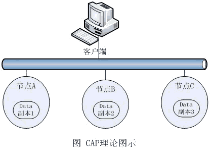

如何正确理解CAP理论？

在大数据领域，被业界广泛谈及的CAP理论存在着一些关键性的认知误区，而只有全面地考察与分析分布式环境中的各种场景，我们才能真正正确地理解它。

　　目前，CAP（Consistency一致性、Availability可用性、Partition-tolerance分区可容忍性）理论普遍被当作是大数据技术的理论基础。同时，根据该理论，业界有一种非常流行、非常“专业”的认识，那就是：关系型数据库设计选择了C（一致性）与A（可用性），NoSQL数据库设计则不同。其中，HBase选择了C（一致性）与P（分区可容忍性），Cassandra选择了A（可用性）与P（分区可容忍性）。

　　该说法现在似乎已经成为一种经典认知，无论是初学大数据技术，还是已经有了相当经验的技术人员，都将其奉为真理。大家大概是认为，从CAP这样著名的理论推导出来的结论，当然是权威而又正确的，最起码在形式上感觉是专业而又严肃的。有人甚至还将这种认知画成一个三角形图，三个顶点分别是C、A、P，三条边分别是关系型数据库、HBase与Cassandra，这样一来，CAP理论就显然更加神圣了。

　　实际上，这种认识是不准确的，甚至是不正确的。暂且不说深入的分析与研究，只要先从表面上简单分析一下，你就能发现问题：难道说从理论上讲Cassandra就一定比HBase的可用性更高吗？而要要彻底搞清楚这个问题，还得先从CAP理论本身开始研究。

常见的理解及分析

　　目前流行的、对CAP理论解释的情形是从同一数据在网络环境中的多个副本出发的。为了保证数据不会丢失，在企业级的数据管理方案中，一般必须考虑数据的冗余存储问题，而这应该是通过在网络上的其他独立物理存储节点上保留另一份、或多份数据副本来实现的（如附图所示）。因为在同一个存储节点上的数据冗余明显不能解决单点故障问题，这与通过多节点集群来提供更好的计算可用性的道理是相同的。
　　

附图 CAP理论示意图

　　其实，不用做严格的证明也可以想见，如附图的情况，数据在节点A、B、C上保留了三份，如果对节点A上的数据进行了修改，然后再让客户端通过网络对该数据进行读取。那么，客户端的读取操作什么时候返回呢？

　　有这样两种情况：一种情况是要求节点A、B、C的三份数据完全一致后返回。也就是说，这时从任何一个网络节点读取的数据都是一样的，这就是所谓的强一致性读。很明显，这时数据读取的Latency要高一些（因为要等数据在网络中的复制），同时A、B、C三个节点中任何一个宕机，都会导致数据不可用。也就是说，要保证强一致性，网络中的副本越多，数据的可用性就越差；

　　另一种情况是，允许读操作立即返回，容忍B节点的读取与A节点的读取不一致的情况发生。这样一来，可用性显然得到了提高，网络中的副本也可以多一些，唯一得不到保证的是数据一致性。当然，对写操作同样也有多个节点一致性的情况，在此不再赘述。

　　可以看出，上述对CAP理论的解释主要是从网络上多个节点之间的读写一致性出发考虑问题的。而这一点，对于关系型数据库意味着什么呢？当然主要是指通常所说的Standby（关于分布式事务，涉及到更多考虑，随后讨论）情况。对此，在实践中我们大多已经采取了弱一致性的异步延时同步方案，以提高可用性。这种情况并不存在关系型数据库为保证C、A而放弃P的情况；而对海量数据管理的需求，关系型数据库扩展过程中所遇到的性能瓶颈，似乎也并不是CAP理论中所描述的那种原因造成的。那么，上述流行的说法中所描述的关系型数据库为保证C、A而牺牲P到底是在指什么呢？

　　因此，如果根据现有的大多数资料对CAP理论的如上解释，即只将其当作分布式系统中多个数据副本之间的读写一致性问题的通用理论对待，那么就可以得出结论：CAP既适用于NoSQL数据库，也适用于关系型数据库。它是NoSQL数据库、关系型数据库，乃至一切分布式系统在设计数据多个副本之间读写一致性问题时需要遵循的共同原则。

更深入的探究：两种重要的分布式场景

　　在本文中我们要说的重点与核心是：关于对CAP理论中一致性C的理解，除了上述数据副本之间的读写一致性以外，分布式环境中还有两种非常重要的场景，如果不对它们进行认识与讨论，就永远无法全面地理解CAP，当然也就无法根据CAP做出正确的解释。但可惜的是，目前为止却很少有人提及这两种场景：那就是事务与关联。

　　先来看看分布式环境中的事务场景。我们知道，在关系型数据库的事务操作遵循ACID原则，其中的一致性C，主要是指一个事务中相关联的数据在事务操作结束后是一致的。所谓ACID原则，是指在写入/异动资料的过程中，为保证交易正确可靠所必须具备的四个特性：即原子性（Atomicity，或称不可分割性）、一致性（Consistency）、隔离性（Isolation，又称独立性）和持久性（Durability）。

　　例如银行的一个存款交易事务，将导致交易流水表增加一条记录。同时，必须导致账户表余额发生变化，这两个操作必须是一个事务中全部完成，保证相关数据的一致性。而前文解释的CAP理论中的C是指对一个数据多个备份的读写一致性。表面上看，这两者不是一回事，但实际上，却是本质基本相同的事物：数据请求会等待多个相关数据操作全部完成才返回。对分布式系统来讲，这就是我们通常所说的分布式事务问题。

　　众所周知，分布式事务一般采用两阶段提交策略来实现，这是一个非常耗时的复杂过程，会严重影响系统效率，在实践中我们尽量避免使用它。在实践过程中，如果我们为了扩展数据容量将数据分布式存储，而事务的要求又完全不能降低。那么，系统的可用性一定会大大降低，在现实中我们一般都采用对这些数据不分散存储的策略。

　　当然，我们也可以说，最常使用的关系型数据库，因为这个原因，扩展性（分区可容忍性P）受到了限制，这是完全符合CAP理论的。但同时我们应该意识到，这对NoSQL数据库也是一样的。如果NoSQL数据库也要求严格的分布式事务功能，情况并不会比关系型数据库好多少。只是在NoSQL的设计中，我们往往会弱化甚至去除事务的功能，该问题才表现得不那么明显而已。

　　因此，在扩展性问题上，如果要说关系型数据库是为了保证C、A而牺牲P，在尽量避免分布式事务这一点上来看，应该是正确的。也就是说：关系型数据库应该具有强大的事务功能，如果分区扩展，可用性就会降低；而NoSQL数据库干脆弱化甚至去除了事务功能，因此，分区的可扩展性就大大增加了。

　　再来看看分布式环境中的关联场景。初看起来，关系型数据库中常用的多表关联操作与CAP理论就更加不沾边了。但仔细考虑，也可以用它来解释数据库分区扩展对关联所带来的影响。对一个数据库来讲，采用了分区扩展策略来扩充容量，数据分散存储了，很显然多表关联的性能就会下降，因为我们必须在网络上进行大量的数据迁移操作，这与CAP理论中数据副本之间的同步操作本质上也是相同的。

　　因此，如果要保证系统的高可用性，需要同时实现强大的多表关系操作的关系型数据库在分区可扩展性上就遇到了极大的限制（即使是那些采用了各种优秀解决方案的MPP架构的关系型数据库，如TeraData，Netezza等，其水平可扩展性也是远远不如NoSQL数据库的），而NoSQL数据库则干脆在设计上弱化甚至去除了多表关联操作。那么，从这一点上来理解“NoSQL数据库是为了保证A与P，而牺牲C”的说法，也是可以讲得通的。当然，我们应该理解，关联问题在很多情况下不是并行处理的优点所在，这在很大程度上与Amdahl定律相符合。

　　所以，从事务与关联的角度来关系型数据库的分区可扩展性为什么受限的原因是最为清楚的。而NoSQL数据库也正是因为弱化，甚至去除了像事务与关联（全面地讲，其实还有索引等特性）等在分布式环境中会严重影响系统可用性的功能，才获得了更好的水平可扩展性。

　　那么，如果将事务与关联也纳入CAP理论中一致性C的范畴的话，问题就很清楚了：关于“关系型数据库为了保证一致性C与可用性A，而不得不牺牲分区可容忍性P”的说法便是正确的了。但关于“NoSQL选择了C与P，或者A与P”的说法则是错误的，所有的NoSQL数据库在设计策略的大方向上都是选择了A与P（虽然对同一数据多个副本的读写一致性问题的设计各有不同），从来没有完全选择C与P的情况存在。

结论

　　现在看来，如果理解CAP理论只是指多个数据副本之间读写一致性的问题，那么它对关系型数据库与NoSQL数据库来讲是完全一样的，它只是运行在分布式环境中的数据管理设施在设计读写一致性问题时需要遵循的一个原则而已，却并不是NoSQL数据库具有优秀的水平可扩展性的真正原因。而如果将CAP理论中的一致性C理解为读写一致性、事务与关联操作的综合，则可以认为关系型数据库选择了C与A，而NoSQL数据库则全都是选择了A与P，但并没有选择C与P的情况存在。这才是用CAP理论来支持NoSQL数据库设计正确认识。

　　其实，这种认识正好与被广泛认同的NoSQL的另一个理论基础相吻合，即与ACID对着干的BASE（基本可用性、软状态与最终一致性）。因为BASE的含义正好是指“NoSQL数据库设计可以通过牺牲一定的数据一致性和容错性来换取高性能的保持甚至提高”，即NoSQL数据库都应该是牺牲C来换取P，而不是牺牲A。可用性A正好是所有NoSQL数据库都普遍追求的特性。