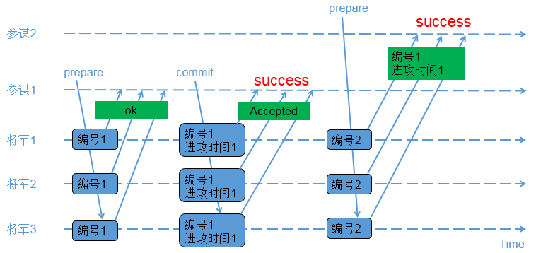
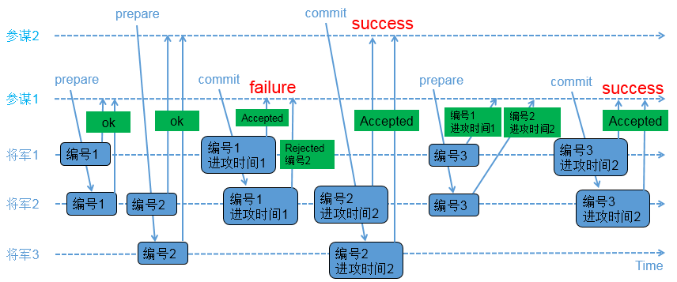

#以两军问题为背景来演绎Basic Paxos

###背景

在计算机通信理论中，有一个著名的两军问题(two-army problem)，讲述通信的双方通过ACK来达成共识，永远会有一个在途的ACK需要进行确认，因此无法达成共识。
两军问题和Basic Paxos非常相似 

- 1） 通信的各方需要达成共识；
- 2） 通信的各方仅需要达成一个共识；
- 3） 假设的前提是信道不稳定，有丢包、延迟或者重放，但消息不会被篡改。

Basic Paxos最早以希腊议会的背景来讲解，但普通人不理解希腊议会的运作模式，因此看Basic Paxos的论文会比较难理解。两军问题的背景大家更熟悉，因此尝试用这个背景来演绎一下Basic Paxos。
为了配合Basic Paxos的多数派概念，把两军改为3军；同时假设了将军和参谋的角色。

假设的3军问题

- 1） 1支红军在山谷里扎营，在周围的山坡上驻扎着3支蓝军；
- 2） 红军比任意1支蓝军都要强大；如果1支蓝军单独作战，红军胜；如果2支或以上蓝军同时进攻，蓝军胜；
- 3） 三支蓝军需要同步他们的进攻时间；但他们惟一的通信媒介是派通信兵步行进入山谷，在那里他们可能被俘虏，从而将信息丢失；或者为了避免被俘虏，可能在山谷停留很长时间；
- 4） 每支军队有1个参谋负责提议进攻时间；每支军队也有1个将军批准参谋提出的进攻时间；很明显，1个参谋提出的进攻时间需要获得至少2个将军的批准才有意义；
- 5） 问题：是否存在一个协议，能够使得蓝军同步他们的进攻时间？
 
接下来以两个假设的场景来演绎BasicPaxos；参谋和将军需要遵循一些基本的规则

- 1） 参谋以两阶段提交（prepare/commit）的方式来发起提议，在prepare阶段需要给出一个编号；
- 2） 在prepare阶段产生冲突，将军以编号大小来裁决，编号大的参谋胜出；
- 3） 参谋在prepare阶段如果收到了将军返回的已接受进攻时间，在commit阶段必须使用这个返回的进攻时间；

###两个参谋先后提议的场景

- 1） 参谋1发起提议，派通信兵带信给3个将军，内容为（编号1）；
- 2） 3个将军收到参谋1的提议，由于之前还没有保存任何编号，因此把（编号1）保存下来，避免遗忘；同时让通信兵带信回去，内容为（ok）；
- 3） 参谋1收到至少2个将军的回复，再次派通信兵带信给3个将军，内容为（编号1，进攻时间1）；
- 4） 3个将军收到参谋1的时间，把（编号1，进攻时间1）保存下来，避免遗忘；同时让通信兵带信回去，内容为（Accepted）；
- 5） 参谋1收到至少2个将军的（Accepted）内容，确认进攻时间已经被大家接收；
 
- 6） 参谋2发起提议，派通信兵带信给3个将军，内容为（编号2）；
- 7） 3个将军收到参谋2的提议，由于（编号2）比（编号1）大，因此把（编号2）保存下来，避免遗忘；又由于之前已经接受参谋1的提议，因此让通信兵带信回去，内容为（编号1，进攻时间1）；
- 8） 参谋2收到至少2个将军的回复，由于回复中带来了已接受的参谋1的提议内容，参谋2因此不再提出新的进攻时间，接受参谋1提出的时间；

###两个参谋交叉提议的场景

- 1） 参谋1发起提议，派通信兵带信给3个将军，内容为（编号1）；
- 2） 3个将军的情况如下
a) 将军1和将军2收到参谋1的提议，将军1和将军2把（编号1）记录下来，如果有其他参谋提出更小的编号，将被拒绝；同时让通信兵带信回去，内容为（ok）；
b) 负责通知将军3的通信兵被抓，因此将军3没收到参谋1的提议；
 
- 3） 参谋2在同一时间也发起了提议，派通信兵带信给3个将军，内容为（编号2）；
- 4） 3个将军的情况如下

a) 将军2和将军3收到参谋2的提议，将军2和将军3把（编号2）记录下来，如果有其他参谋提出更小的编号，将被拒绝；同时让通信兵带信回去，内容为（ok）；

b) 负责通知将军1的通信兵被抓，因此将军1没收到参谋2的提议；
 
- 5） 参谋1收到至少2个将军的回复，再次派通信兵带信给有答复的2个将军，内容为（编号1，进攻时间1）；
- 6） 2个将军的情况如下
a) 将军1收到了（编号1，进攻时间1），和自己保存的编号相同，因此把（编号1，进攻时间1）保存下来；同时让通信兵带信回去，内容为（Accepted）；
b) 将军2收到了（编号1，进攻时间1），由于（编号1）小于已经保存的（编号2），因此让通信兵带信回去，内容为（Rejected，编号2）；
 
- 7） 参谋2收到至少2个将军的回复，再次派通信兵带信给有答复的2个将军，内容为（编号2，进攻时间2）；
- 8） 将军2和将军3收到了（编号2，进攻时间2），和自己保存的编号相同，因此把（编号2，进攻时间2）保存下来，同时让通信兵带信回去，内容为（Accepted）；
- 9） 参谋2收到至少2个将军的（Accepted）内容，确认进攻时间已经被多数派接受；
 
- 10） 参谋1只收到了1个将军的（Accepted）内容，同时收到一个（Rejected，编号2）；参谋1重新发起提议，派通信兵带信给3个将军，内容为（编号3）；
- 11） 3个将军的情况如下  

a) 将军1收到参谋1的提议，由于（编号3）大于之前保存的（编号1），因此把（编号3）保存下来；由于将军1已经接受参谋1前一次的提议，因此让通信兵带信回去，内容为（编号1，进攻时间1）；
  
b) 将军2收到参谋1的提议，由于（编号3）大于之前保存的（编号2），因此把（编号3）保存下来；由于将军2已经接受参谋2的提议，因此让通信兵带信回去，内容为（编号2，进攻时间2）；  

c) 负责通知将军3的通信兵被抓，因此将军3没收到参谋1的提议；

- 12） 参谋1收到了至少2个将军的回复，比较两个回复的编号大小，选择大编号对应的进攻时间作为最新的提议；参谋1再次派通信兵带信给有答复的2个将军，内容为（编号3，进攻时间2）；
- 13） 将军1和将军2收到了（编号3，进攻时间2），和自己保存的编号相同，因此保存（编号3，进攻时间2），同时让通信兵带信回去，内容为（Accepted）；
- 14） 参谋1收到了至少2个将军的（accepted）内容，确认进攻时间已经被多数派接受；

###小结

BasicPaxos算法难理解，除了讲故事的背景不熟悉之外，还有以下几点

- 1） 参与的各方并不是要针锋相对，拼个你死我活；而是要合作共赢，最终达成一个共识；当大家讲起投票的时候，往往第一反应是要针锋相对，没想到是要合作共赢；很明显可以想到，在第二个场景下，如果参谋1为了逞英雄，强行要提交他提出的进攻时间1，那么最终是无法达成一个共识的；这里的点就在于参谋1违反了规则，相当于产生了拜占庭错误；
- 2） 常规的通信协议设计，对于写操作，通常都是只返回成功和失败的状态，不会返回更多的东西；但BasicPaxos的prepare和commit，将军除了返回成功还是失败的状态之外，还会把之前已经发生的一些状态带回给参谋，这个和常规的通信协议是不同的；
- 3） 在两军问题的背景下，其实知道进攻时间被至少2个将军接受的是参谋，而不是将军；在“两个参谋交叉提议的场景”下，当参谋1没有做第2次prepare之前，将军1记录的其实是一个错误的进攻时间；理论上来说，任何一个将军在任何一个时刻都无法判断自己不是处在将军1的场景下；因此BasicPaxos在3个蓝军组成的系统中达成了一个共识，但并没有为每个将军明确了共识；
- 4） 本文的两个场景都以“两个参谋”来讲，这里的“两个参谋”可能是真的两个不同的参谋，也可能是同一个参谋因为某种原因先后做了多次提议；对应分布式系统的场景
a） 真的有两个并发的client
b） 两个client一先一后；第一个client执行到某个步骤因为某种原因停止了；过了一段时间，另外一个client接着操作同一个数据
c） 同一个client重试；第一次执行到某一步骤因为某种原因停止了，立即或者稍后进行了重试
后记

写这篇文章的时候，参考了以下两篇文章。
 
Paxos算法细节详解(一)--通过现实世界描述算法
http://www.cnblogs.com/endsock/p/3480093.html
 
第一篇文章用了我们喜闻乐见的背景，大部分内容非常容易理解，尤其是用比特币来映射编号，非常贴切；只是对于proposer-1小姐最后的“背叛”会有点违反常识。看完这个故事之后就一直在想更贴切的背景。在两军问题中，蓝军各方是要合作达成一个共识；对于参谋来说，获得了前一个参谋的提议就接受，而不再提出自己的提议是符合逻辑的，这个和paxos也更加吻合。在实际的分布式系统中，如果遇到冲突，涉及的各方也不是要针锋相对争个你死我活，想要的只是能发现冲突，只有一方成功、或者全部失败都无所谓，只要能保证数据一致就行。
以两军问题为背景，在提议编号上找不到合适的映射点，比较生硬，这一点不如第一遍文章中的故事。
 
Question 7: The Two Generals’ Problem of reaching consensus on when to attack is unsolvable, how come it’s possible to have consensus with Paxos?
http://bogdan.pistol.gg/2014/10/20/paxos-algorithm-explained-part-2-insights/#q7
 
paxos最终仍然无法解决两军问题，即使是扩展到3军也是无法解决的。在3军背景下，按paxos算法的定义，最后是达成了一个共同的进攻时间，3军中的任何一方都可以通过paxos算法读取出这个进攻时间。但3军怎么知道在什么时候去读取、其他人是否已经读取，这是一个和两军问题同样的问题；同时由于通信兵可能无限延迟，可能部分蓝军在进攻时间之前读取到了，部分蓝军可能在进攻时间之后才读取到，所以两军最终还是无解的。第二篇参考文章中也详细描述了这些问题。所以写paxos和两军问题，不是说paxos解决了两军问题，只是借用两军问题的背景来演绎paxos。
 

