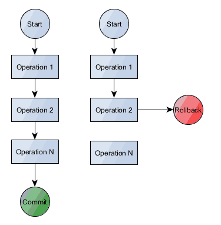
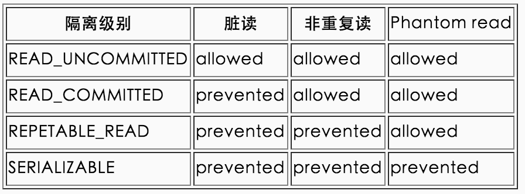
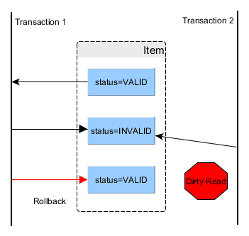
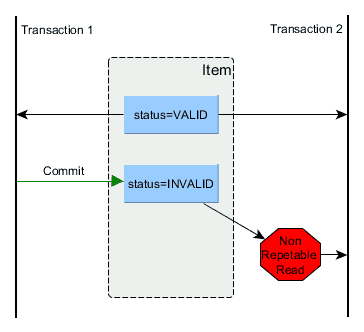
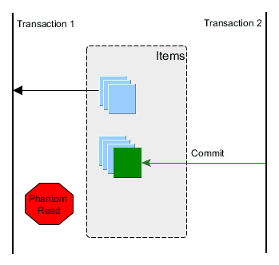
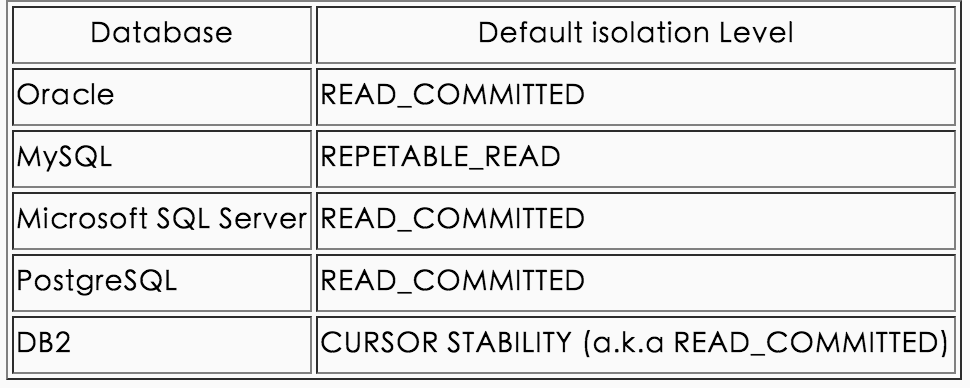

#什么是数据库ACID?

　　事务在当今的企业系统无处不在，即使在高并发环境下也可以提供数据的完整性。一个事务是一个只包含所有读/写操作成功的集合。如下图：
　　

一个事务本质上有四个特点ACID：

- Atomicity原子性
- Consistency一致性
- Isolation隔离性
- Durability耐久性

###原子性

原子性任务是一个独立的操作单元，是一种要么全部是，要么全部不是的原子单位性的操作。

###一致性

一个事务可以封装状态改变（除非它是一个只读的）。事务必须始终保持系统处于一致的状态，不管在任何给定的时间并发事务有多少。

一致性有下面特点：

如果一个操作触发辅助操作（级联，触发器），这些也必须成功，否则交易失败。
如果系统是由多个节点组成，一致性规定所有的变化必须传播到所有节点（多主复制）。如果从站节点是异步更新，那么我们打破一致性规则，系统成为“最终一致性”。
一个事务是数据状态的切换，因此，如果事务是并发多个，系统也必须如同串行事务一样操作。
在现实中，事务系统遭遇并发请求时，这种串行化是有成本的， Amdahl法则描述如下：它是描述序列串行执行和并发之间的关系。

“一个程序在并行计算情况下使用多个处理器所能提升的速度是由这个程序中串行执行部分的时间决定的。”

大多数数据库管理系统选择（默认情况下）是放宽一致性，以达到更好的并发性。

###隔离性

事务是并发控制机制，他们交错使用时也能提供一致性。隔离让我们隐藏来自外部世界未提交的状态变化，一个失败的事务不应该破坏系统的状态。隔离是通过用悲观或乐观锁机制实现的。

 

###耐久性

一个成功的事务将永久性地改变系统的状态，所以在它结束之前，所有导致状态的变化都记录在一个持久的事务日志中。如果我们的系统突然受到系统崩溃或断电，那么所有未完成已提交的事务可能会重演。

 

尽管一些数据库系统提供多版本并发控制 MVCC, 他们的并发控制都是通过锁完成，因此，锁会增加执行的串行性，影响并发性。

 

SQL标准规定了四个隔离水平：

- READ_UNCOMMITTED
- READ_COMMITTED
- REPETABLE_READ
- SERIALIZABLE

###脏读

脏读发生在：当一个事务允许读取一个被其他事务改变但是未提交的状态时，这是因为并没有锁阻止读取，如上图，你看到第二个事务读取了一个并不一致的值，不一致的意思是，这个值是无效的，因为修改这个值的第一个事务已经回滚，也就是说，第一个事务修改了这个值，但是未提交确认，却被第二个事务读取，第一个事务又放弃修改，悔棋了，而第二个事务就得到一个脏数据。

###非重复读

反复读同一个数据却得到不同的结果，这是因为在反复几次读取的过程中，数据被修改了，这就导致我们使用了stale数据，这可以通过一个共享读锁来避免。这是隔离级别READ_COMMITTED会导致可重复读的原因。设置共享读锁也就是隔离级别提高到REPETABLE_READ。

###Phantom 读

当第二个事务插入一行记录，而正好之前第一个事务查询了应该包含这个新纪录的数据，那么这个查询事务的结果里肯定没有包含这个刚刚新插入的数据，这时幻影读发生了，通过变化锁和predicate locking避免。

下图是主流数据库的默认隔离级别：

READ_COMMITED 是正确的选择，因为SERIALIZABLE虽然能在不同事务发生时避免stale数据，也就是避免上述丢失刚刚修改的数据，但是性能是最低的，因为是一种最大化的串行。
